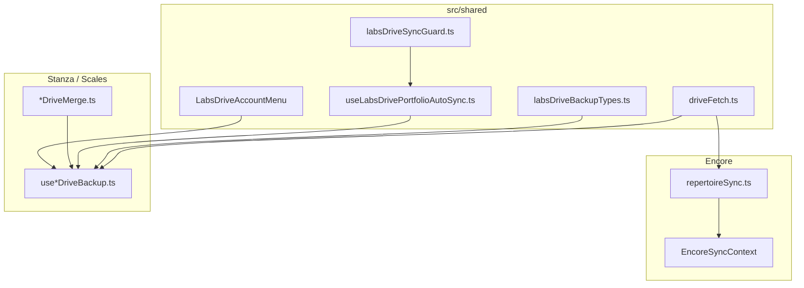
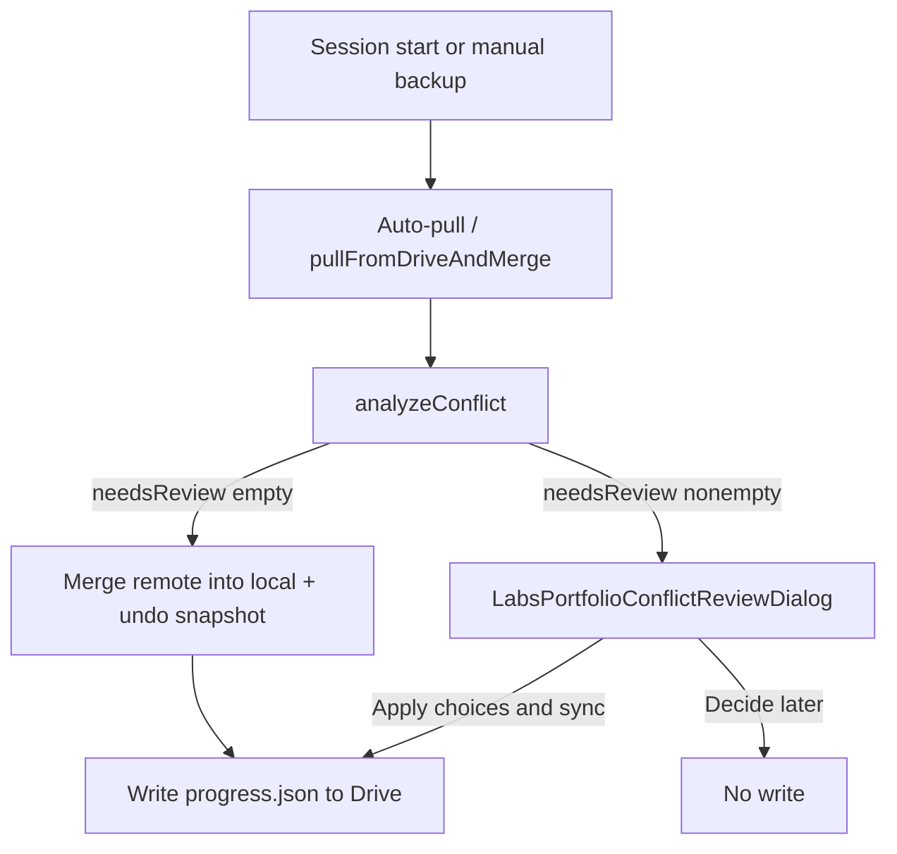

# Local-first sync (Google Drive)

Canonical reference for how Labs micro-apps sync user data with Google Drive. Solo dev: treat this doc + linked ADRs as the product bar for sync UX and data-loss prevention.

**Quick map:** OAuth paths, merge policies, and per-app entry points → [`SYNC_AND_AUTH_MAP.md`](SYNC_AND_AUTH_MAP.md).

**P0 data-loss:** Agent checklist + guard parity → [`DRIVE_SYNC_DATA_LOSS_PREVENTION.md`](DRIVE_SYNC_DATA_LOSS_PREVENTION.md).

## Apps with Drive sync

| App          | Model                                             | Drive location                                         | Local store         |
| ------------ | ------------------------------------------------- | ------------------------------------------------------ | ------------------- |
| **Encore**   | Continuous bidirectional repertoire + Originals   | `Encore_App/`                                          | Dexie (`encoreDb`)  |
| **Stanza**   | Auto pull/push portfolio backup                   | `Tiff Zhang Labs/Stanza/progress.json` + `stem_audio/` | Dexie (`stanzaDb`)  |
| **Scales**   | Same as Stanza                                    | `Tiff Zhang Labs/LearnYourScales/progress.json`        | Progress reducer    |
| **Gesture**  | Portfolio backup (packs + draw history)           | `Tiff Zhang Labs/Gesture/progress.json`                | Dexie (`gestureDb`) |
| **Zine Box** | Portfolio backup (comics + stacks + PDF sidecars) | `Tiff Zhang Labs/ZineBox/progress.json` + `comics/`    | Dexie (`zineboxDb`) |

No other micro-apps use Drive JSON backup today. Encore also uses Drive for uploads, picker, public snapshot, and guest reads — separate from the JSON sync loops below.

## Binary uploads (resumable)

Large media (Encore performance videos, Stanza stems, Gesture packs, Zine PDFs) go through [`driveUploadFileResumable`](../src/shared/drive/driveFetch.ts) → [`uploadDriveFileResumableChunked`](../src/shared/drive/driveResumableUpload.ts).

**Invariants:**

1. **Chunk PUTs use XHR, not `fetch`.** Drive returns HTTP **308 Resume Incomplete** after non-final chunks. Browser `fetch` treats 308 as a redirect and fails the request even when Drive accepted the bytes (`drive-resumable-308`).
2. **Resume after suspend.** On network errors (including Chrome `ERR_NETWORK_IO_SUSPENDED`), wait until the document is visible, query session status (`Content-Range: bytes */N`), then continue from Drive’s cursor (`network-io-suspended`).
3. **Progress + wake lock.** Callers should pass `onProgress` into the blocking job; the uploader requests a screen wake lock for the transfer duration.

Do not reintroduce a single full-file `fetch` PUT for “simplicity” — it looked fine for multi‑GB one-shot uploads until chunked resume was required, and `fetch`+308 silently breaks every multi-chunk browser upload.

## Principles

1. **Local-first** — Dexie / in-memory progress is the working copy. Apps work offline without Google.
2. **Background by default** — Session auto-pull, **periodic re-pull while the tab is visible** (every 5 min), debounced auto-push (3 s); no toast on every success.
3. **Data-loss guards** — Empty devices must not overwrite richer cloud data; undo snapshots before destructive merges; deletions propagate where union-merge would resurrect rows. **Filled content must never be silently lost to an empty/sparser copy** — merge compound rows by stable sub-entity id ("content beats empty" always), not whole-row last-writer-wins, and expose revision-history restore. See [ADR 0019](adr/0019-encore-non-destructive-sync-merge.md) + [Data-loss prevention principles](#data-loss-prevention-principles-all-sync-apps).
4. **Silent merge by default** — All portfolio apps use **`silent_union`**. Divergence (cloud newer + local edits) auto-merges; prompt only for **true row-level conflicts** (`needsReview`). See [ADR 0020](adr/0020-silent-union-sync-row-conflicts-only.md) and [Divergence vs conflict](#divergence-vs-conflict).
5. **Shared UX for portfolio apps** — Stanza, Scales, Gesture, and Zine Box use [`LabsDriveAccountMenu`](../src/shared/google/LabsDriveAccountMenu.tsx) + [`LabsPortfolioConflictReviewDialog`](../src/shared/google/LabsPortfolioConflictReviewDialog.tsx) when `needsReview.length > 0`. Encore uses the same analysis semantics with content-aware sub-entity merge (ADR 0019).
6. **No silent OAuth refresh** — ADR 0010/0011; user re-authenticates explicitly when tokens expire (optional BFF refresh per ADR 0014).

## Divergence vs conflict

| Signal                                                                  | Meaning                                                                                                          | User action                                                                                                                         |
| ----------------------------------------------------------------------- | ---------------------------------------------------------------------------------------------------------------- | ----------------------------------------------------------------------------------------------------------------------------------- |
| **Divergence** (`drive_file_newer_than_seen`, local edits since backup) | Another device saved, or this device edited                                                                      | **Auto-merge** (union + non-destructive field merge); optional snackbar                                                             |
| **True conflict** (`needsReview`)                                       | Same stable entity edited on both sides since last sync baseline **and** auto-merge would drop non-empty content | [`LabsPortfolioConflictReviewDialog`](../src/shared/google/LabsPortfolioConflictReviewDialog.tsx) — per-row Keep device / Use Drive |

Shared analysis: [`labsPortfolioConflictAnalysis.ts`](../src/shared/drive/labsPortfolioConflictAnalysis.ts). Canonical decision: [ADR 0020](adr/0020-silent-union-sync-row-conflicts-only.md).

## Portfolio merge prompt policy

Shared type: [`LabsPortfolioMergePromptPolicy`](../src/shared/drive/labsDriveBackupTypes.ts). Each app exports a constant in `*DriveConflict.ts`.

| Policy                       | When to use                                                                                                                                     | Apps today                                        |
| ---------------------------- | ----------------------------------------------------------------------------------------------------------------------------------------------- | ------------------------------------------------- |
| **`silent_union`** (default) | Never block pull on divergence alone. Run row analysis; open review dialog only if `needsReview.length > 0`. Undo snapshots are the safety net. | **Stanza**, **Gesture**, **Scales**, **Zine Box** |
| **`row_review`** (Encore)    | Same analysis semantics; content-aware sub-entity merge (ADR 0019).                                                                             | **Encore**                                        |

**Deprecated:** `prompt_when_both_edited` (coarse Merge / Replace dialog). Do not use for new apps.

**Default for new portfolio apps:** `LABS_PORTFOLIO_MERGE_PROMPT_POLICY_DEFAULT` (`silent_union`).

**Assessment vs prompt:** `assessLabsDriveBackupConflict` records _divergence_ for diagnostics and copy only. `shouldBlockSyncForConflict(analysis)` gates the user when `needsReview.length > 0`.

**Manual backup pattern:**

1. Undo snapshot (`manual-backup`)
2. `pullFromDriveAndMerge({ silent: true })` — merge remote into local (or open row review if needed)
3. `flushDriveWrite()` — upload merged envelope

**Undo:** Restore → **Undo last sync** (pre-pull snapshot) rolls back a bad merge. Overwrite Drive with this device is Restore → Advanced only (not everyday sync).

## Architecture

### Shared layer (`src/shared/drive/` + `src/shared/google/`)

| Module                                                                                             | Role                                                  |
| -------------------------------------------------------------------------------------------------- | ----------------------------------------------------- |
| [`driveFetch.ts`](../src/shared/drive/driveFetch.ts)                                               | OAuth Drive v3 client                                 |
| [`labsDrivePortfolioLayout.ts`](../src/shared/drive/labsDrivePortfolioLayout.ts)                   | `Tiff Zhang Labs/{App}/progress.json` layout          |
| [`labsDriveBackupTypes.ts`](../src/shared/drive/labsDriveBackupTypes.ts)                           | Conflict assessment (`assessLabsDriveBackupConflict`) |
| [`labsDriveSyncGuard.ts`](../src/shared/drive/labsDriveSyncGuard.ts)                               | Blocks auto-push until pull or manual backup          |
| [`labsDrivePortfolioBackupConstants.ts`](../src/shared/drive/labsDrivePortfolioBackupConstants.ts) | Debounce / interval constants                         |
| [`labsDriveSyncMessages.ts`](../src/shared/drive/labsDriveSyncMessages.ts)                         | Shared sync status copy                               |
| [`useLabsDrivePortfolioAutoSync.ts`](../src/shared/drive/useLabsDrivePortfolioAutoSync.ts)         | Auto-pull once + debounced auto-push effects          |
| [`LabsBlockingJobContext.tsx`](../src/shared/jobs/LabsBlockingJobContext.tsx)                      | Sticky snackbar + `beforeunload` for long jobs        |
| [`labsDriveBackupUiTypes.ts`](../src/shared/google/labsDriveBackupUiTypes.ts)                      | UI prop types for restore/conflict dialogs            |
| [`LabsDriveAccountMenu.tsx`](../src/shared/google/LabsDriveAccountMenu.tsx)                        | Account menu + restore + conflict shell               |

App-local code owns envelope schema, merge logic, tombstones, and progress subscriptions (Scales).

### Union merge must not resurrect removals

Portfolio apps default to **silent union merge**: local and remote rows are combined by stable id (comic id, pack folder id, stack id, etc.). Without extra guards, a removal on one device can reappear after auto-pull because the other side still lists the row.

| Removal type           | App                                                | Envelope / local tombstone                                                     | Merge filter                                                                      |
| ---------------------- | -------------------------------------------------- | ------------------------------------------------------------------------------ | --------------------------------------------------------------------------------- |
| Delete entity          | Zine Box comics, Gesture packs/files, Stanza songs | `deletedIds` / folder or file tombstones                                       | Skip tombstoned ids when unioning                                                 |
| Remove from collection | **Zine Box stack unlink**                          | `removedStackMemberships` (`stackId::comicId`) in envelope + localStorage ring | Filter `itemIds` in `mergeCollection` — **do not** union remote `itemIds` back in |

**Checklist when adding delete or “remove from group” UX:**

1. Record tombstone on user action (local ring + next push envelope field).
2. Honor tombstones in merge **before** unioning membership lists or entity maps.
3. Regression test: local removal → merge with remote that still includes the row → row stays removed.
4. Toast copy: report **adds** and **remote updates** only — overlap counts (`*Merged`) are diagnostics, not user-facing (see [Merge report copy](#merge-report-copy)).

Implementation: Zine Box [`zineboxDriveStackTombstones.ts`](../src/zinebox/drive/zineboxDriveStackTombstones.ts), comic tombstones, [`zineboxDriveMerge.ts`](../src/zinebox/drive/zineboxDriveMerge.ts).

### Merge report copy

Auto-pull toasts and account-menu success copy must reflect **user-visible remote changes** only:

- **Show:** rows added from Drive, rows updated because remote had newer metadata/progress.
- **Hide:** overlap counts (“merged N comics”, “merged overlapping progress”) when nothing actually changed on this device.

Each app exposes `*MergeReportHasUserVisibleRemoteChanges(report)` beside `format*DriveMergeReport`. Shared transient toast routing: [`useLabsDriveSyncToastMessage`](../src/shared/google/useLabsDriveSyncToastMessage.ts).

## Data-loss guards

| Guard                                | Encore                                                                                                                                                                                                    | Stanza / Scales / Gesture                                                           |
| ------------------------------------ | --------------------------------------------------------------------------------------------------------------------------------------------------------------------------------------------------------- | ----------------------------------------------------------------------------------- |
| Empty device cannot push sparse data | Pull when remote newer; conflict when both dirty                                                                                                                                                          | `labsDriveAutoPushAllowed` until pull or manual backup                              |
| **Empty never clobbers filled**      | **Content-aware merge** ([`encoreRepertoireMerge.ts`](../src/encore/drive/encoreRepertoireMerge.ts), ADR 0019): exercise runs merge by id; a filled run always beats an empty one regardless of timestamp | n/a (portfolio payloads are union-merged maps, not embedded answer blobs)           |
| Pre-merge undo                       | `encoreDriveUndoSnapshots` (localStorage)                                                                                                                                                                 | Stanza IDB ring; Scales localStorage ring; Gesture localStorage ring                |
| Revision-history recovery            | **Recover answers from Drive history** (account menu) → [`encoreRecoveryRunner.ts`](../src/encore/drive/encoreRecoveryRunner.ts) scans `repertoire_data.json` revisions                                   | Drive keeps revisions; no in-app restore UI yet (backlog)                           |
| Deletion propagation                 | Row delete in repertoire push                                                                                                                                                                             | Stanza/Gesture tombstones in envelope; Zine Box comic + stack membership tombstones |
| Simultaneous edits                   | Row-level `bothEdited` dialog (shows answer counts)                                                                                                                                                       | Stanza: merge prompt; Scales/Gesture: silent union merge                            |
| OAuth token expiry                   | Sync error state in account menu                                                                                                                                                                          | `syncPaused` + shared reconnect copy                                                |

### Data-loss prevention principles (all sync apps)

Distilled from the Encore "Because of You" incident (ADR 0019). Apply to **every** cloud-synced app:

1. **Non-destructive merge for additive content.** An empty or sparser copy must never silently
   overwrite filled content — even when it has a newer timestamp or the user picked it in a coarse
   conflict prompt. "Content beats empty" is the floor.
2. **Merge by stable sub-entity id**, not whole-row last-writer-wins, whenever a row embeds rich
   user content (answers, notes, lists). Union the parts; pick per-part, not per-row.
3. **Content-aware conflict surfacing.** Show what is at stake (e.g. "device: 12 answers · Drive: 0")
   so a destructive pick is never blind. Never offer a bare "Use Drive / Keep device" for rows that
   carry hours of work without saying what each side holds.
4. **Revision history is a first-class recovery path.** Synced JSON keeps Drive revisions; expose an
   in-app "restore from older version" flow rather than relying on the user to dig through Drive.
5. **Clocks must reflect content.** Don't bump `updatedAt` on no-op opens; treat wall-clock LWW as a
   fragile heuristic, not a source of truth, for deciding what to discard.
6. **Minimize the local-only window.** Content that exists only on the device (filled but not yet
   pushed) is the most fragile state — it is invisible to revision-history recovery until it reaches
   the cloud. Flush pending pushes on `visibilitychange→hidden` / `pagehide` so closing a tab does
   not strand fresh work (Encore + portfolio `useLabsDrivePortfolioAutoSync`), and write a local pre-sync snapshot before any destructive op so even
   never-synced content is recoverable from the device. Recovery scans **both** Drive revisions and
   local snapshots (Encore `encoreRecoveryRunner.ts`). Caveat: if local-only content is wiped before
   any snapshot or push captures it, it is genuinely unrecoverable — which is why the flush + snapshot
   guards matter.

## Conflict decision tree

### Portfolio apps (Stanza, Scales, Gesture)

**Divergence reasons** (diagnostics only via `assessLabsDriveBackupConflict`):

- `drive_file_newer_than_seen` — Drive `modifiedTime` > device `lastCloudModifiedTime`
- `remote_export_newer_than_last_backup` — envelope `exportedAt` > device `lastBackupExportedAt`
- `drive_nonempty_first_device` — no prior sync meta but remote has content

**All portfolio apps (`silent_union`):** auto-pull and manual backup merge silently when `needsReview` is empty, then push. Row review only for true conflicts (ADR 0020).

### Encore

When local and remote both changed since last sync:

- **`bothEdited.length === 0`** — silent auto-merge by `updatedAt`; brief snackbar
- **`bothEdited.length > 0`** — [`SyncConflictReviewDialog`](../src/encore/components/SyncConflictReviewDialog.tsx) per row (keep device vs use Drive); content-aware merge (ADR 0019)

See [`src/encore/ARCHITECTURE.md`](../src/encore/ARCHITECTURE.md) § Sync state machine.

## UX conventions

| Situation       | Expected behavior                                                                                                 |
| --------------- | ----------------------------------------------------------------------------------------------------------------- |
| Happy path      | Silent auto-pull/push; periodic re-pull every 5 min while tab visible; “Last backup …” in account menu when known |
| Token expired   | “Sign in again to sync” / “Drive sync paused …” (see `labsDriveSyncMessages.ts`)                                  |
| Cloud diverged  | **`silent_union`:** merge in background; optional account-menu note. **Stanza:** dialog when both sides edited.   |
| Restore         | Drive latest + local undo snapshots ([`LabsDriveRestoreDialog`](../src/shared/google/LabsDriveRestoreDialog.tsx)) |
| Clear site data | Undo snapshots lost; Drive remains recovery path (restore dialog copy)                                            |

## Long-running jobs (portfolio + Encore)

**Canonical module:** [`LabsBlockingJobContext.tsx`](../src/shared/jobs/LabsBlockingJobContext.tsx) — bottom snackbar with indeterminate/determinate progress, `role="status"`, and a “keep this tab open” caption. **`beforeunload` is armed only while at least one non-silent job is running.**

| App                 | Provider                                                                                        | Hook                      |
| ------------------- | ----------------------------------------------------------------------------------------------- | ------------------------- |
| **Encore**          | `EncoreBlockingJobProvider` (wraps shared; Encore-specific caption)                             | `useEncoreBlockingJobs()` |
| **Gesture**         | `LabsBlockingJobProvider` in `App.tsx`                                                          | `useLabsBlockingJobs()`   |
| **Stanza / Scales** | Adopt shared provider when adding user-visible bulk work (today: account-menu sync status only) | `useLabsBlockingJobs()`   |

### When to wrap work

| Wrap with **`withBlockingJob(label, fn)`** (loud)                  | Use **`{ silent: true }`** or no job                                                |
| ------------------------------------------------------------------ | ----------------------------------------------------------------------------------- |
| User launched; **> ~1 s**; writes Dexie or Drive                   | Debounced auto-push, session auto-pull, background re-index                         |
| Uploads, imports, merge/delete/organize, refresh index, bulk edits | Quick local toggles, typing, navigation                                             |
| Anything the user should not navigate away from mid-flight         | Pair `{ silent: true }` with account-menu / `syncState` copy when work is invisible |

### UX rules (all Drive-synced apps)

1. **One sticky snackbar** per app shell — do not add a second full-width progress bar in tab content for the same job.
2. **Do not dim the whole page** for background work — disable only the control that was pressed (or block conflicting actions, e.g. uploads).
3. **Update the snackbar label** as phases change (`startBlockingJob` → `updateLabel` / `updateProgress`).
4. **Counted work** (imports, uploads, merges) — use `reportBlockingJobItemProgress` from [`labsBlockingJobItemProgress.ts`](../src/shared/jobs/labsBlockingJobItemProgress.ts) so the label reads `Importing 3 of 50…` and the shared snackbar shows **complete · remaining** under the bar. Do not leave a static total-only label while items stream in.
5. **Dialogs** may show a short status line; **progress bar lives in the snackbar**, not duplicated in the dialog body.
6. **Completion toasts** — optional success/error banner at top (`GestureStatusBanner`, Encore snackbar) after the blocking job ends; the blocking snackbar clears in `finally`.

### Adopting in a new app (do not fork)

When a micro-app needs long-running job UX, **copy Encore’s wiring first** — do not invent app-local snackbars, docked bars, or theme-specific progress UI.

1. **Provider at app root** — wrap the shell in `LabsBlockingJobProvider` (or a thin re-export like `EncoreBlockingJobProvider`) so hooks such as `useGestureDriveBackup` can call `withBlockingJob`.
2. **Default shared chrome** — use the stock snackbar from `LabsBlockingJobContext` + `labsBlockingJob.css`. Theme tokens (`background.paper`, `primary`, `shape.borderRadius`) adapt per app automatically.
3. **Wrap every user-launched job** — scan, organize, backup, refresh, upload, merge, delete. Inline button spinners and account-menu “busy” copy are not a substitute; disable the control and let the snackbar carry progress.
4. **Only customize after shipping** — `snackbarBottom`, `unloadCaption`, or shared-module polish when Encore and Gesture both need it. **Do not** add app CSS overrides (e.g. full-width Linen dock) unless the user explicitly rejects the shared look.
5. **Reference** — Encore: [`EncoreBlockingJobContext.tsx`](../src/encore/context/EncoreBlockingJobContext.tsx), [`EncoreActionsContext.tsx`](../src/encore/context/EncoreActionsContext.tsx) (`reorganizeDriveUploads`). Gesture: [`App.tsx`](../src/gesture/App.tsx), [`GestureAccountMenu.tsx`](../src/gesture/components/GestureAccountMenu.tsx).

**Tests:** [`LabsBlockingJobContext.test.tsx`](../src/shared/jobs/LabsBlockingJobContext.test.tsx), Encore re-exports in [`EncoreBlockingJobContext.test.tsx`](../src/encore/context/EncoreBlockingJobContext.test.tsx).

## Spinning up a new portfolio Drive app

Use this checklist when adding local-first + `Tiff Zhang Labs/{App}/progress.json` backup (Zine Box followed this in 2026).

### Copy from an existing app (recommended: Stanza if you have blob sidecars; Scales if metadata-only)

| Layer     | Shared (reuse)                                                                          | App-local (implement once)                                   |
| --------- | --------------------------------------------------------------------------------------- | ------------------------------------------------------------ |
| Layout    | `labsDrivePortfolioLayout.ts` — add `LABS_DRIVE_APP_FOLDER_*` constant                  | —                                                            |
| Lifecycle | `useLabsDrivePortfolioAutoSync.ts`, `labsDriveSyncGuard.ts`, `labsDriveBackupTypes.ts`  | `use*DriveBackup.ts` hook                                    |
| UI        | `LabsDriveAccountMenu.tsx`, `LabsDriveRestoreDialog.tsx`, `LabsDriveConflictDialog.tsx` | Thin `*AccountMenu.tsx` + optional `*DriveBackupContext.tsx` |
| Jobs      | `LabsBlockingJobProvider` at app root when uploads/imports exist                        | Wrap sign-in, backup, restore in `withBlockingJob`           |
| OAuth     | `ensureLabsGoogleAccessTokenForDrive()` (or import scopes helper if folder import)      | App-specific scope wrapper if needed                         |

### App-local modules (mirror naming)

1. `*DriveEnvelope.ts` — `schemaVersion`, `exportedAt`, `app` id, payload arrays
2. `*DriveMerge.ts` — union merge + per-field heuristics; unit tests required
3. `*DriveConflict.ts` — export `*_PORTFOLIO_MERGE_PROMPT_POLICY` (`silent_union` unless you need Stanza-style prompts)
4. `*DriveSyncMeta.ts` — `localStorage` sync meta (cloud modified time, last export)
5. `*LocalData.ts` — `read/writeLocalPayload` against Dexie or store
6. Optional `*Drive*Sync.ts` — blob sidecar upload/download (PDFs, stems, photos)
7. Change bus or Dexie hooks — **must** call `notify*LocalChange({ immediate: true })` on bulk import/first edit so auto-push is not swallowed by the shared priming skip

### Wiring checklist

- [ ] `*DriveBackupProvider` at app root (or account menu if Stanza-style)
- [ ] Portfolio hook: prefer `createLabsPortfolioDriveBackup(config)` + app config module (see Zine Box `zineboxPortfolioDriveBackupConfig.ts`)
- [ ] `useLabsDrivePortfolioAutoSync({ enabled: testerResolved && testerOk, ... })`
- [ ] Manual backup: snapshot → silent pull/merge → `flushDriveWrite`
- [ ] `flushDriveWrite`: upload sidecars → write envelope; **412 etag retry** (pull then rewrite)
- [ ] Treat `isLabsDrivePortfolioProgressPlaceholder()` as “no backup yet” on pull
- [ ] Document in this file + app `README.md` § Google sign-in
- [ ] Add row to [`labs-drive-backup` skill](../.cursor/skills/labs-drive-backup/SKILL.md) app table

### Duplication we should consolidate next (not blocking ship)

| Pattern                    | Today                                                           | Target                                                                              |
| -------------------------- | --------------------------------------------------------------- | ----------------------------------------------------------------------------------- |
| Portfolio hook boilerplate | ~400 lines × 4 apps                                             | `createLabsPortfolioDriveBackup(config)` in `src/shared/drive/` (Zine Box migrated) |
| 412 retry on push          | Stanza + Zine Box only                                          | Shared `flushPortfolioProgressWithRetry`                                            |
| Tombstones                 | Gesture, Stanza, Zine Box                                       | Template + merge filter helper for new apps with delete UX                          |
| Conflict UI dead code      | Gesture/Scales/Zine Box ship dialog wiring under `silent_union` | Drop prompt UI or switch policy explicitly                                          |

## Stanza ↔ Encore data model

**Accepted:** [ADR 0007 revision Option B](adr/0007-revision-stanza-encore-federated-sync.md) — federated sidecar under `Encore_App/stanza_practice_overlay.json`.

Until overlay migration lands:

- Stanza `progress.json` remains the active backup path (ADR 0006).
- Encore uploads dedup scans Stanza `stem_audio/` to avoid duplicating stem bytes ([`labsDrivePortfolioDedupFolders.ts`](../src/shared/drive/labsDrivePortfolioDedupFolders.ts)).
- Overlay schema: [`stanzaPracticeOverlay.ts`](../src/stanza/drive/stanzaPracticeOverlay.ts) (not wired to sync yet).
- Migration checklist: [`stanza-encore-overlay-migration.md`](design-explorations/stanza-encore-overlay-migration.md).

**Uploads:** Stanza direct uploads stay common; Encore should reuse existing Drive files (dedup prompt) rather than upload duplicates. Full Encore↔Stanza upload linking is a follow-up after overlay migration.

**OAuth BFF:** [ADR 0014](./adr/0014-google-oauth-session-bff.md) — optional Cloudflare Worker when `VITE_LABS_SESSION_BFF_URL` is set. GIS silent refresh stays off (ADR 0010/0011); BFF refresh uses HTTPS only.

## Known gaps

| Gap                   | Notes                                                                                    |
| --------------------- | ---------------------------------------------------------------------------------------- |
| Dual canonical stores | Stanza `progress.json` vs Encore repertoire until overlay migration (Option B accepted)  |
| Tester gate           | **Removed (GA)** — optional `VITE_LABS_DRIVE_TESTER_HASHES` only for staging restriction |
| Scales tombstones     | Not needed while there is no delete-progress UX; add if reset ships                      |
| Sharded Encore sync   | Opt-in via `VITE_ENCORE_SHARDED_SYNC`; Stanza does not consume shards yet                |
| Multi-tab             | Debounced push only; document one tab per app                                            |
| Clock skew            | Heuristics use ISO string compare, not NTP                                               |

## Related ADRs

- [0006](./adr/0006-stanza-drive-backup-merge-and-restore.md) — Stanza auto-sync, tombstones, undo
- [0007](./adr/0007-encore-owned-practice-resources-stanza-secondary-client.md) — Encore-owned resources (original)
- [0007 revision](./adr/0007-revision-stanza-encore-federated-sync.md) — Federated sidecar (**accepted**)
- [0010](./adr/0010-encore-no-background-google-refresh.md) / [0011](./adr/0011-labs-stanza-scales-no-background-google-refresh.md) — OAuth posture (no GIS silent refresh)
- [0014](./adr/0014-google-oauth-session-bff.md) — optional Google session BFF (Cloudflare Workers)
- [0012 Scales](./adr/0012-scales-drive-sync-parity.md) — Scales parity with Stanza safety model
- [0012 Originals](./adr/0012-encore-originals-local-first-domain.md) — Encore Originals domain
- [0019](./adr/0019-encore-non-destructive-sync-merge.md) — Encore content-aware non-destructive merge + revision recovery

## Agent workflow

- Skill: [`.cursor/skills/labs-drive-backup`](../.cursor/skills/labs-drive-backup/SKILL.md)
- Before changing envelope shape: read app hook + merge module + this doc
- OAuth or sync contract changes → `labs-write-adr` skill
- **`npm run presubmit`** before merge
