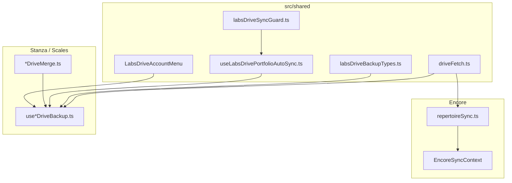
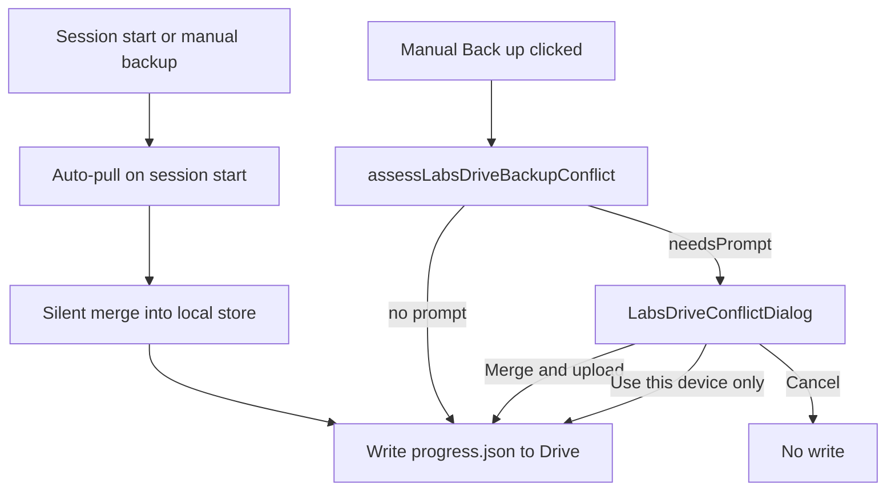

# Local-first sync (Google Drive)

Canonical reference for how Labs micro-apps sync user data with Google Drive. Solo dev: treat this doc + linked ADRs as the product bar for sync UX and data-loss prevention.

## Apps with Drive sync

| App         | Model                                           | Drive location                                         | Local store         |
| ----------- | ----------------------------------------------- | ------------------------------------------------------ | ------------------- |
| **Encore**  | Continuous bidirectional repertoire + Originals | `Encore_App/`                                          | Dexie (`encoreDb`)  |
| **Stanza**  | Auto pull/push portfolio backup                 | `Tiff Zhang Labs/Stanza/progress.json` + `stem_audio/` | Dexie (`stanzaDb`)  |
| **Scales**  | Same as Stanza                                  | `Tiff Zhang Labs/LearnYourScales/progress.json`        | Progress reducer    |
| **Gesture** | Portfolio backup (packs + draw history)         | `Tiff Zhang Labs/Gesture/progress.json`                | Dexie (`gestureDb`) |

No other micro-apps use Drive JSON backup today. Encore also uses Drive for uploads, picker, public snapshot, and guest reads — separate from the JSON sync loops below.

## Principles

1. **Local-first** — Dexie / in-memory progress is the working copy. Apps work offline without Google.
2. **Background by default** — Session auto-pull, **periodic re-pull while the tab is visible** (every 5 min), debounced auto-push (3 s); no toast on every success.
3. **Data-loss guards** — Empty devices must not overwrite richer cloud data; undo snapshots before destructive merges; deletions propagate where union-merge would resurrect rows.
4. **Prompt only when judgment is needed** — Silent merge when heuristics are safe; dialogs when overwrite or per-row choices matter.
5. **Shared UX for portfolio apps** — Stanza and Scales use [`LabsDriveAccountMenu`](../src/shared/google/LabsDriveAccountMenu.tsx); Encore uses its own account menu with row-level conflict UI.
6. **No silent OAuth refresh** — ADR 0010/0011; user re-authenticates explicitly when tokens expire.

## Architecture

### Shared layer (`src/shared/drive/` + `src/shared/google/`)

| Module                                                                                             | Role                                                  |
| -------------------------------------------------------------------------------------------------- | ----------------------------------------------------- |
| [`driveFetch.ts`](../src/shared/drive/driveFetch.ts)                                               | OAuth Drive v3 client                                 |
| [`labsDrivePortfolioLayout.ts`](../src/shared/drive/labsDrivePortfolioLayout.ts)                   | `Tiff Zhang Labs/{App}/progress.json` layout          |
| [`labsDriveBackupTypes.ts`](../src/shared/drive/labsDriveBackupTypes.ts)                           | Conflict assessment (`assessLabsDriveBackupConflict`) |
| [`labsDriveSyncGuard.ts`](../src/shared/drive/labsDriveSyncGuard.ts)                               | Blocks auto-push until pull or manual backup          |
| [`labsDrivePortfolioBackupConstants.ts`](../src/shared/drive/labsDrivePortfolioBackupConstants.ts) | Debounce / interval constants                         |
| [`labsDriveSyncMessages.ts`](../src/shared/drive/labsDriveSyncMessages.ts)                         | Shared sync status copy                               |
| [`useLabsDrivePortfolioAutoSync.ts`](../src/shared/drive/useLabsDrivePortfolioAutoSync.ts)         | Auto-pull once + debounced auto-push effects          |
| [`labsDriveBackupUiTypes.ts`](../src/shared/google/labsDriveBackupUiTypes.ts)                      | UI prop types for restore/conflict dialogs            |
| [`LabsDriveAccountMenu.tsx`](../src/shared/google/LabsDriveAccountMenu.tsx)                        | Account menu + restore + conflict shell               |

App-local code owns envelope schema, merge logic, tombstones (Stanza), and progress subscriptions (Scales).

## Data-loss guards

| Guard                                | Encore                                           | Stanza / Scales                                                            |
| ------------------------------------ | ------------------------------------------------ | -------------------------------------------------------------------------- |
| Empty device cannot push sparse data | Pull when remote newer; conflict when both dirty | `labsDriveAutoPushAllowed` until pull or manual backup                     |
| Pre-merge undo                       | `encoreDriveUndoSnapshots` (IDB)                 | Stanza IDB ring; Scales localStorage ring                                  |
| Deletion propagation                 | Row delete in repertoire push                    | Stanza tombstones in envelope (`deletedDriveSourceFileIds`)                |
| Simultaneous edits                   | Row-level `bothEdited` dialog                    | Per-song / per-exercise merge heuristics; conflict dialog on manual backup |
| OAuth token expiry                   | Sync error state in account menu                 | `syncPaused` + shared reconnect copy                                       |

## Conflict decision tree

### Portfolio apps (Stanza, Scales, Gesture)

**Conflict reasons** (any one triggers prompt on manual backup):

- `drive_file_newer_than_seen` — Drive `modifiedTime` > device `lastCloudModifiedTime`
- `remote_export_newer_than_last_backup` — envelope `exportedAt` > device `lastBackupExportedAt`
- `drive_nonempty_first_device` — no prior sync meta but remote has content

Auto-pull **merges silently** when the cloud looks newer but **this device has no local edits since the last backup** (`shouldPromptBeforePortfolioMerge` returns false). If both sides changed, the conflict dialog opens (including on session auto-pull — account menu message points users there).

Manual backup uses the same rule (not merely `assessment.needsPrompt`).

### Encore

When local and remote both changed since last sync:

- **`bothEdited.length === 0`** — silent auto-merge by `updatedAt`; brief snackbar
- **`bothEdited.length > 0`** — [`SyncConflictReviewDialog`](../src/encore/components/SyncConflictReviewDialog.tsx) per row (keep device vs use Drive)

See [`src/encore/ARCHITECTURE.md`](../src/encore/ARCHITECTURE.md) § Sync state machine.

## UX conventions

| Situation       | Expected behavior                                                                                                 |
| --------------- | ----------------------------------------------------------------------------------------------------------------- |
| Happy path      | Silent auto-pull/push; periodic re-pull every 5 min while tab visible; “Last backup …” in account menu when known |
| Token expired   | “Sign in again to sync” / “Drive sync paused …” (see `labsDriveSyncMessages.ts`)                                  |
| Conflict        | Merge primary; replace-only with warning when cloud is richer                                                     |
| Restore         | Drive latest + local undo snapshots ([`LabsDriveRestoreDialog`](../src/shared/google/LabsDriveRestoreDialog.tsx)) |
| Clear site data | Undo snapshots lost; Drive remains recovery path (restore dialog copy)                                            |

## Stanza ↔ Encore data model

**Accepted:** [ADR 0007 revision Option B](adr/0007-revision-stanza-encore-federated-sync.md) — federated sidecar under `Encore_App/stanza_practice_overlay.json`.

Until overlay migration lands:

- Stanza `progress.json` remains the active backup path (ADR 0006).
- Encore uploads dedup scans Stanza `stem_audio/` to avoid duplicating stem bytes ([`labsDrivePortfolioDedupFolders.ts`](../src/shared/drive/labsDrivePortfolioDedupFolders.ts)).
- Overlay schema: [`stanzaPracticeOverlay.ts`](../src/stanza/drive/stanzaPracticeOverlay.ts) (not wired to sync yet).
- Migration checklist: [`stanza-encore-overlay-migration.md`](design-explorations/stanza-encore-overlay-migration.md).

**Uploads:** Stanza direct uploads stay common; Encore should reuse existing Drive files (dedup prompt) rather than upload duplicates. Full Encore↔Stanza upload linking is a follow-up after overlay migration.

**OAuth BFF:** [ADR 0014](./adr/0014-google-oauth-session-bff.md) — optional Cloudflare Worker when `VITE_LABS_SESSION_BFF_URL` is set. GIS silent refresh stays off (ADR 0010/0011); BFF refresh uses HTTPS only.

## Known gaps

| Gap                   | Notes                                                                                    |
| --------------------- | ---------------------------------------------------------------------------------------- |
| Dual canonical stores | Stanza `progress.json` vs Encore repertoire until overlay migration (Option B accepted)  |
| Tester gate           | **Removed (GA)** — optional `VITE_LABS_DRIVE_TESTER_HASHES` only for staging restriction |
| Scales tombstones     | Not needed while there is no delete-progress UX; add if reset ships                      |
| Sharded Encore sync   | Opt-in via `VITE_ENCORE_SHARDED_SYNC`; Stanza does not consume shards yet                |
| Multi-tab             | Debounced push only; document one tab per app                                            |
| Clock skew            | Heuristics use ISO string compare, not NTP                                               |

## Related ADRs

- [0006](./adr/0006-stanza-drive-backup-merge-and-restore.md) — Stanza auto-sync, tombstones, undo
- [0007](./adr/0007-encore-owned-practice-resources-stanza-secondary-client.md) — Encore-owned resources (original)
- [0007 revision](./adr/0007-revision-stanza-encore-federated-sync.md) — Federated sidecar (**accepted**)
- [0010](./adr/0010-encore-no-background-google-refresh.md) / [0011](./adr/0011-labs-stanza-scales-no-background-google-refresh.md) — OAuth posture (no GIS silent refresh)
- [0014](./adr/0014-google-oauth-session-bff.md) — optional Google session BFF (Cloudflare Workers)
- [0012 Scales](./adr/0012-scales-drive-sync-parity.md) — Scales parity with Stanza safety model
- [0012 Originals](./adr/0012-encore-originals-local-first-domain.md) — Encore Originals domain

## Agent workflow

- Skill: [`.cursor/skills/labs-drive-backup`](../.cursor/skills/labs-drive-backup/SKILL.md)
- Before changing envelope shape: read app hook + merge module + this doc
- OAuth or sync contract changes → `labs-write-adr` skill
- **`npm run presubmit`** before merge
