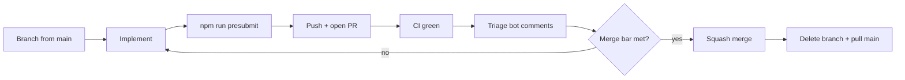

# Pull request workflow (solo developer)

Labs has **no human code review**. Pull requests exist for three reasons:

1. **CI gate** — GitHub Actions runs lint, typecheck, tests, e2e smoke, and build before code lands on `main`.
2. **Audit trail** — Each merge is a squash commit with a PR title/body you (or an agent) can search later.
3. **Scoped rollback** — One PR ≈ one revert unit if production misbehaves.

Bots (e.g. CodeRabbit) are **optional signal**, not approvers. They can rate-limit or miss context; **green CI + local presubmit** is the merge bar.

Canonical merge policy for this repo: **squash merge** into `main`, **delete the branch** after merge.

## When to open a PR vs push to `main`

| Situation                                                                 | Prefer                                                                                   |
| ------------------------------------------------------------------------- | ---------------------------------------------------------------------------------------- |
| Feature, refactor, multi-file change, or anything that should run full CI | **PR**                                                                                   |
| Agent batch work (decomposition series, roadmap slices)                   | **PR per slice** — skill `labs-split-to-prs`                                             |
| Docs-only typo on `main` you want live in 30 seconds                      | Direct commit to `main` is OK if you accept skipping PR CI (still run presubmit locally) |
| Visual/audio baseline updates                                             | **PR + explicit human review** of snapshot diffs — never silent baseline refresh         |
| Hotfix for broken `main`                                                  | Branch + PR (or hotfix branch); use [rollback workflow](ROLLBACK.md) if already deployed |

Default for agents: **branch → PR → merge**, unless you explicitly say “commit/push to main.”

## Branch naming

```
refactor/<short-topic>     # behavior-preserving splits
fix/<short-topic>          # bug fixes
feat/<short-topic>         # user-visible features
docs/<short-topic>         # docs-only
chore/<short-topic>        # tooling, deps, CI
```

One logical change per branch. Prefer **≤ ~400 lines** diff when splitting is easy (see `labs-split-to-prs`).

## End-to-end loop



### 1. Branch

```bash
git fetch origin
git checkout main && git pull
git checkout -b refactor/my-topic
```

### 2. Implement + verify locally

Before **every** push that you intend to merge:

```bash
npm run presubmit
```

Presubmit matches the Husky pre-commit hook (import boundaries, lint, knip, typecheck, fast tests). CI also runs e2e smoke and other checks — see `.github/workflows/ci.yml`.

### 3. Push and open PR

```bash
git push -u origin HEAD
gh pr create --title "Short imperative title" --body "$(cat <<'EOF'
## Summary
- …

## Test plan
- [x] `npm run presubmit`
- [ ] …
EOF
)"
```

Use the [PR template](../.github/pull_request_template.md). For solo work, **Summary + Test plan** are enough; skip Bug-fix handoff unless it was a regression fix.

### 4. CI without blocking the session

CI takes **≈8–15 min**. Agents and humans should not sit idle watching checks unless babysitting a merge.

| Do locally (before push)                                | Defer to CI                                |
| ------------------------------------------------------- | ------------------------------------------ |
| `npm run presubmit`                                     | Full Vitest (`npm test`), e2e smoke, build |
| `npm run test:e2e:smoke` when touching routes/shells    | Visual regression (advisory)               |
| Hard-refresh affected hash routes after provider wiring | Pages deploy                               |

**Agent workflow — fire-and-forget + fix on failure** (default; rule [`ci-background-watch.mdc`](../.cursor/rules/ci-background-watch.mdc))

1. Run **presubmit** on the final commit; fix failures before push. This is the real gate — CI is the safety net.
2. **Push + open PR**; tell the user the PR URL.
3. **Arm auto-merge** so green merges itself, no agent action needed:
   ```bash
   gh pr merge <n> --auto --squash --delete-branch
   ```
4. **Background-watch for failure only** — start `ci:watch` as a backgrounded job and keep working:
   ```bash
   npm run ci:watch -- <n>   # silent while pending; prints one CI_WATCH: PASS|FAIL|… sentinel
   ```
   Agents: run it with `block_until_ms: 0` and a `notify_on_output` regex `^CI_WATCH: (FAIL|TIMEOUT|ERROR)`. **Do not** poll CI in chat or `AwaitShell` the watcher.
5. **Immediately continue** the next unit of work. On a failure ping: `npm run report:ci-failure -- <run-id>`, fix within the PR's scope, push again (auto-merge re-arms), restart `ci:watch`.
6. Prefer **small PRs** (`labs-split-to-prs`) so CI surface area stays small and failures are easier to attribute.
7. **Direct push to `main`** only for trivial docs typos when skipping PR CI is acceptable — still run presubmit locally.

Block synchronously (foreground babysit) **only** when the user asked to merge now, it's a hotfix for broken `main`, or it's the last action of the session. Honest hand-off: backgrounded watchers are session-scoped — auto-merge still lands green PRs after the session ends, but a _failure_ after the session ends stays a red open PR (caught by `gh pr list` next session or the Nightly detector). Never claim a PR merged/green that you did not observe.

**Human workflow**

- Enable GitHub **allow auto-merge** (one-time): `gh api repos/tiffz/labs -X PATCH -f allow_auto_merge=true` — see [`docs/PR_WORKFLOW.md`](docs/PR_WORKFLOW.md) § Auto-merge.
- Queue **auto-merge squash** on PRs you trust: `gh pr merge <n> --auto --squash --delete-branch`.
- Re-run failed **`test`** once for known Vitest teardown flakes (`docs/CI_RELIABILITY.md`); fix if persistent.
- Use **`gh pr checks --watch`** only when actively babysitting — not as default agent idle time.

See also: [`docs/CI_RELIABILITY.md`](CI_RELIABILITY.md) (concurrency cancellation, deploy retry).

### 5. Wait for CI (when babysitting)

Watch the **`test`** job on the PR (≈8–15 min). CodeRabbit may comment; treat inline suggestions as a **second pair of eyes**, not a veto.

**Merge blockers**

- Any required CI check failed
- You have not run presubmit on the latest commit
- Visual/audio snapshot changes you have not inspected
- Known flaky failure you have not confirmed is unrelated (re-run CI once; merge latest `main` if branch is stale)

**Not merge blockers**

- CodeRabbit rate limit / “review skipped”
- CodeRabbit nit with no CI impact (still fix quick wins like syntax errors)
- Empty human review (there are no human reviewers)

### 6. Triage feedback

Skill: **`labs-babysit-pr`**.

1. Read **inline review comments** and **CI logs** only — ignore bot walkthrough noise unless it points at a real bug.
2. Fix valid issues on the PR branch; push; wait for CI again.
3. Reply on fixed threads when the bot asked for a specific change (optional; helps future you).

Do **not** weaken CI, skip hooks, or `--no-verify` to merge.

### 7. Merge

When CI is green and presubmit passed on HEAD:

```bash
gh pr merge <number> --squash --delete-branch
git checkout main && git pull
```

### Auto-merge (optional, recommended)

Enable once per repo so PRs merge automatically when required checks pass:

```bash
# One-time repo setting (requires admin)
gh api repos/tiffz/labs -X PATCH -f allow_auto_merge=true

# Per PR — queue squash merge when CI green (after push)
gh pr merge <number> --auto --squash --delete-branch
```

**Requirements:** Branch protection on `main` with required status checks (`test` job). Auto-merge waits for green CI; it does not skip presubmit locally.

If `allow_auto_merge` is already true, only the per-PR `--auto` step is needed.

Merge **stacked PRs in dependency order** (foundation first). After merging PR _n_, rebase or merge `main` into downstream branches before merging _n+1_.

**Rapid merges:** Merging several PRs back-to-back triggers multiple `CI/CD` runs; workflow **concurrency** cancels superseded runs — check the **latest** run on `main`. Pages **deploy** uses its own concurrency group; transient `in progress deployment` errors are auto-retried once (see [`docs/CI_RELIABILITY.md`](CI_RELIABILITY.md)).

Agents: merge only when the user asked to merge (or babysit through merge-ready **and** merge).

### 7. After merge

- Confirm [open PRs](https://github.com/tiffz/labs/pulls) list is clean for that batch.
- Continue decomposition/refactor series from updated `main`.
- Optional: note process learnings in PR § Process improvements or skill `labs-session-retrospective`.

## Review signal hierarchy (solo)

| Priority | Signal                                                         | Action                            |
| -------- | -------------------------------------------------------------- | --------------------------------- |
| 1        | CI failed                                                      | Fix or abort merge                |
| 2        | Local presubmit failed                                         | Fix before push                   |
| 3        | Guardrail / regression test you added                          | Must pass                         |
| 4        | CodeRabbit inline **actionable** bug (syntax, logic, security) | Fix if valid                      |
| 5        | CodeRabbit style/nit                                           | Fix if trivial; otherwise backlog |
| 6        | CodeRabbit rate limit                                          | Ignore for merge decision         |

## Splitting large work

Use skill **`labs-split-to-prs`**:

- Propose slices → get approval → one PR per slice → presubmit each → merge in order.
- Example series: route registry → SessionScreen helpers → ScoreDisplay helpers.

Do not open five PRs and merge all at once without checking CI on each; merge sequentially reduces “everything broke at once” debugging.

### Velocity: split feature trains

When a session touches **CI + multiple apps + e2e + docs** (common agent batch), split before push:

1. **Infra slice** — workflows, presubmit scripts, agent docs (no product UI).
2. **App slice(s)** — one micro-app or subsystem per PR (`labs-split-to-prs`).
3. **Baselines slice** — visual/audio PNG updates alone when possible.

Each slice: `npm run presubmit:push` → push → wait for green CI → merge → next slice. Monolithic commits save chat time but cost **one full CI cycle per fix** when smokes drift.

Set `LABS_PRESUBMIT_PUSH=1` in your shell profile to enforce e2e smokes on every push via Husky (see `.husky/pre-push`).

## Agent + user conventions

| Action            | Default                                                   |
| ----------------- | --------------------------------------------------------- |
| Commit            | Ask first (unless you said “commit”)                      |
| Push              | Ask first (unless you said “push”)                        |
| Open PR           | Ask first (unless you said “open a PR”)                   |
| Merge             | Ask first (unless you said “merge” / “babysit and merge”) |
| Force-push `main` | Never without explicit request                            |

## Related docs

- [`docs/CI_RELIABILITY.md`](CI_RELIABILITY.md) — Actions reliability, deploy path, triage
- [`.github/workflows/ci.yml`](../.github/workflows/ci.yml) — what CI actually runs
- [`docs/REGRESSION_WORKFLOW.md`](REGRESSION_WORKFLOW.md) — visual/audio baselines
- [`docs/ROLLBACK.md`](ROLLBACK.md) — production rollback
- [`AGENTS.md`](../AGENTS.md) — agent boundaries and task routing
- Skills: `labs-babysit-pr`, `labs-split-to-prs`
