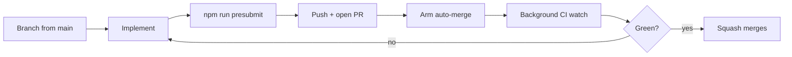

# Pull request workflow (solo developer)

Labs has **no human code review**. PRs exist for: (1) **CI gate**, (2) **audit trail** (squash commit), (3) **scoped rollback**. Bots are optional signal; **green CI + local presubmit** is the merge bar.

Canonical merge: **squash** into `main`, **delete branch** after merge.

## When to open a PR vs push to `main`

| Situation                              | Prefer                                                                    |
| -------------------------------------- | ------------------------------------------------------------------------- |
| Feature, refactor, multi-file, full CI | **PR**                                                                    |
| Agent batch / roadmap slices           | **PR per slice** — skill `labs-split-to-prs`                              |
| Docs-only typo, need live in seconds   | Direct `main` OK if you accept skipping PR CI (still `npm run presubmit`) |
| Visual/audio baseline updates          | **PR + explicit human review** of diffs — never silent refresh            |
| Hotfix for broken `main`               | Branch + PR; [ROLLBACK.md](ROLLBACK.md) if already deployed               |

Default for agents: **branch → PR → merge**, unless told “commit/push to main.”

## Branch naming

`refactor/|fix/|feat/|docs/|chore/<short-topic>` — one logical change; prefer ≤ ~400 lines when splitting is easy (`labs-split-to-prs`).

## End-to-end loop



### 1. Branch

```bash
git fetch origin && git checkout main && git pull
git checkout -b feat/my-topic
```

### 2. Presubmit (before every merge-intended push)

```bash
npm run presubmit
```

Matches Husky pre-commit. CI also runs e2e smoke/build — see `.github/workflows/ci.yml`.

### 3. Push and open PR

```bash
git push -u origin HEAD
gh pr create --title "Short imperative title" --body "$(cat <<'EOF'
## Summary
- …

## Test plan
- [x] `npm run presubmit`
EOF
)"
```

Use [`.github/pull_request_template.md`](../.github/pull_request_template.md). Summary + Test plan are enough for solo work.

### 4. Auto-merge + CI without blocking

**Default agent flow** (do not idle on CI): rule [`.cursor/rules/ci-background-watch.mdc`](../.cursor/rules/ci-background-watch.mdc).

```bash
gh pr merge <n> --auto --squash --delete-branch
npm run ci:watch -- <n>   # background; notify on FAIL only
```

Presubmit is the real gate; CI is the safety net. On failure: `npm run report:ci-failure -- <run-id>`, fix in PR scope, push, restart watch. Foreground babysit only when user asked to merge now, hotfix for broken `main`, or last action of the session — skill **`labs-babysit-pr`**.

**One-time repo setting** (admin): `gh api repos/tiffz/labs -X PATCH -f allow_auto_merge=true`.

| Do locally before push                               | Defer to CI                   |
| ---------------------------------------------------- | ----------------------------- |
| `npm run presubmit`                                  | Full Vitest, e2e smoke, build |
| `npm run test:e2e:smoke` when touching routes/shells | Visual regression (advisory)  |

Honest limits: background watchers are session-scoped; auto-merge still lands green PRs after the session ends. Never claim merged/green without observing it. Reliability notes: [`CI_RELIABILITY.md`](CI_RELIABILITY.md).

### 5. Merge bar (solo)

| Block merge                            | Not a blocker                                 |
| -------------------------------------- | --------------------------------------------- |
| Required CI failed                     | CodeRabbit rate limit / no human review       |
| Presubmit not run on HEAD              | Style nits with no CI impact (fix if trivial) |
| Unreviewed visual/audio snapshot diffs | Empty human review                            |

Never weaken CI, skip hooks, or `--no-verify` to merge. Agents merge only when the user asked (or babysit through merge).

Stacked PRs: merge foundation first; rebase/merge `main` into downstream before next. Rapid merges cancel superseded CI runs — check the **latest** run on `main`.

## Splitting large work

Skill **`labs-split-to-prs`**. Feature trains that touch CI + multiple apps + e2e: infra slice → app slice(s) → baselines slice. Merge sequentially (green CI each). Set `LABS_PRESUBMIT_PUSH=1` to enforce e2e on every push via Husky.

## Agent + user conventions

| Action                          | Default                                |
| ------------------------------- | -------------------------------------- |
| Commit / push / open PR / merge | Ask first (unless user said that verb) |
| Force-push `main`               | Never without explicit request         |

## Related

- [`CI_RELIABILITY.md`](CI_RELIABILITY.md) · [`REGRESSION_WORKFLOW.md`](REGRESSION_WORKFLOW.md) · [`ROLLBACK.md`](ROLLBACK.md)
- Skills: `labs-babysit-pr`, `labs-split-to-prs`
