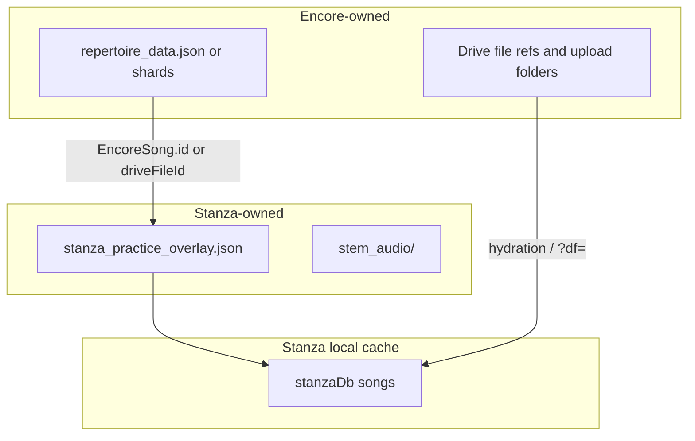

# ADR 0007 revision: Stanza ↔ Encore federated sync

## Status

**Accepted** (2026-06-04) — supersedes implementation timing of [ADR 0007](./0007-encore-owned-practice-resources-stanza-secondary-client.md) without changing its core ownership principles.

## Product decisions (signed off)

| #   | Question                 | Decision                                                                                                                                                                                                                                                      |
| --- | ------------------------ | ------------------------------------------------------------------------------------------------------------------------------------------------------------------------------------------------------------------------------------------------------------- |
| 1   | Data model               | **Option B — federated sidecar** under `Encore_App/stanza_practice_overlay.json`                                                                                                                                                                              |
| 2   | Auto-pull conflicts      | **Silent merge only when it cannot drop local edits**; otherwise show [`LabsDriveConflictDialog`](../../src/shared/google/LabsDriveConflictDialog.tsx) (implemented via [`shouldPromptBeforePortfolioMerge`](../../src/shared/drive/labsDriveBackupTypes.ts)) |
| 3   | Tester gate              | **Remove sooner** — Drive backup open to all signed-in Google users unless `VITE_LABS_DRIVE_TESTER_HASHES` restricts deploy                                                                                                                                   |
| 4   | Stanza vs Encore uploads | **Stanza direct uploads stay common**; no Encore reuse workflow yet beyond shared Drive files. **Encore must not duplicate** bytes already on Drive from Stanza (stem folder indexed in duplicate scan)                                                       |
| 5   | Token refresh BFF        | **Implemented** — [ADR 0014](./0014-google-oauth-session-bff.md); opt-in via `VITE_LABS_SESSION_BFF_URL`                                                                                                                                                      |

## Target architecture (Option B)

| Entity                                                          | Canonical store                               | Stanza behavior                                                            |
| --------------------------------------------------------------- | --------------------------------------------- | -------------------------------------------------------------------------- |
| Song identity, spine, reference/backing links, upload placement | Encore repertoire                             | Read-only mirror when linked                                               |
| Markers, metronome, mix, skip, takes                            | `stanza_practice_overlay.json`                | Read/write; marker-safe merge                                              |
| Main uploaded audio bytes                                       | Encore-managed or shared `drive.file` uploads | Re-download on open; Stanza local uploads remain device-local until linked |
| Stem bytes                                                      | `stem_audio/` (today)                         | Keep; indexed for Encore upload dedup                                      |
| YouTube-only practice                                           | Overlay slice                                 | Stanza-only until linked to Encore                                         |

## Implementation state

| Piece                                      | Status                                                                                                                                                                                                                                                                                  |
| ------------------------------------------ | --------------------------------------------------------------------------------------------------------------------------------------------------------------------------------------------------------------------------------------------------------------------------------------- |
| Overlay schema scaffolding                 | Done — [`stanzaPracticeOverlay.ts`](../../src/stanza/drive/stanzaPracticeOverlay.ts)                                                                                                                                                                                                    |
| Portfolio auto-pull conflict gate          | Done — shared + Stanza/Scales hooks                                                                                                                                                                                                                                                     |
| Tester gate removal (GA default)           | Done — [`labsDriveTesterGate.ts`](../../src/shared/google/labsDriveTesterGate.ts)                                                                                                                                                                                                       |
| Encore dedup includes Stanza `stem_audio/` | Done — [`labsDrivePortfolioDedupFolders.ts`](../../src/shared/drive/labsDrivePortfolioDedupFolders.ts)                                                                                                                                                                                  |
| Dual-read / dual-write migration           | **Stanza side done** — pull merges + push rewrites the overlay in [`useStanzaDriveBackup.ts`](../../src/stanza/hooks/useStanzaDriveBackup.ts); Encore-side read/linking remains — see [`stanza-encore-overlay-migration.md`](../design-explorations/stanza-encore-overlay-migration.md) |
| OAuth BFF / token refresh                  | **Done** — ADR 0014; feature-flagged                                                                                                                                                                                                                                                    |

## Upload dedup policy (decision 4)

- Stanza may continue uploading practice media (local imports, stems) under `Tiff Zhang Labs/Stanza/`.
- Encore upload dedup scans **Encore-managed folders + Stanza `stem_audio/`** (read-only folder lookup; does not create portfolio layout).
- Future: index `driveSourceFileId` references from Stanza envelope and overlay when migration lands; link Encore repertoire rows instead of re-uploading the same bytes.

## Migration phases (unchanged)

1. Dual-read overlay + legacy `progress.json`
2. Dual-write (overlay primary)
3. Read overlay only; deprecate Stanza portfolio file
4. Remove legacy path after documented release + undo path

## Links

- [`docs/LOCAL_FIRST_SYNC.md`](../LOCAL_FIRST_SYNC.md)
- [ADR 0006](./0006-stanza-drive-backup-merge-and-restore.md)
- [ADR 0007 original](./0007-encore-owned-practice-resources-stanza-secondary-client.md)
- [`stanza-encore-overlay-migration.md`](../design-explorations/stanza-encore-overlay-migration.md)
