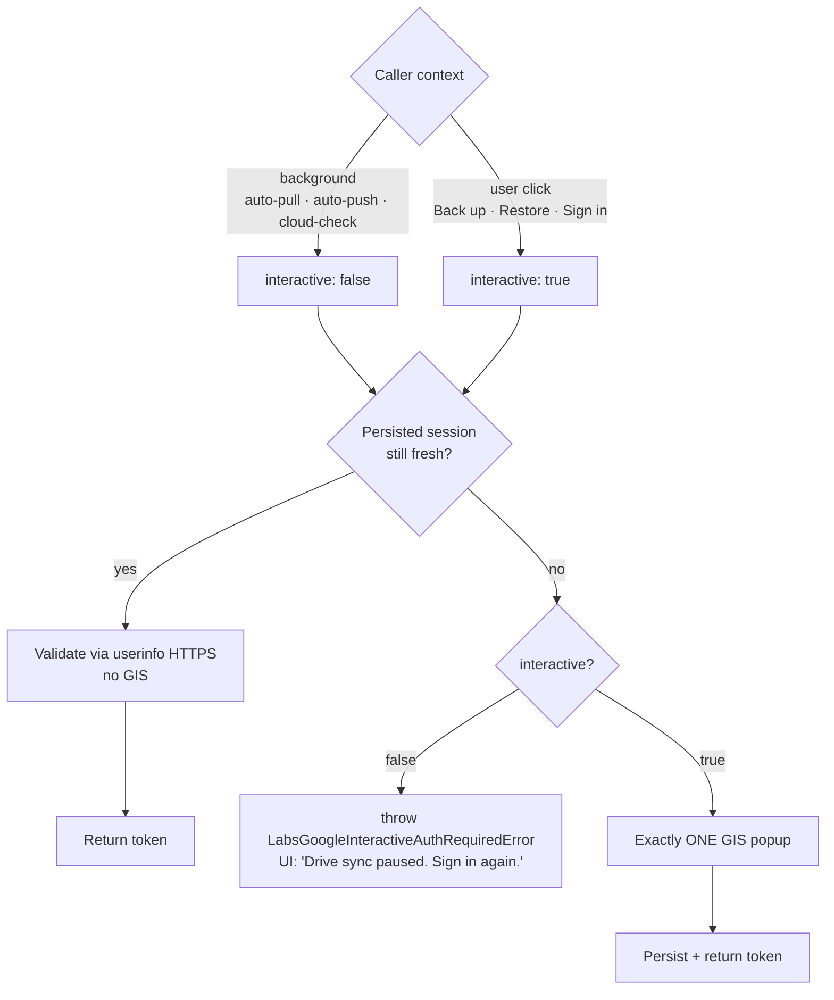

# ADR 0011: Stanza / Scales / shared Labs Google sign-in never silently refreshes in the background

## Status

Accepted.

## Context

[ADR 0010](./0010-encore-no-background-google-refresh.md) eliminated Encore's four sources of
background Google Identity Services (GIS) calls and confined the popup to a single
click-driven path. The "Consequences" section of that ADR explicitly carved out the cohabiting
Labs apps as a follow-up:

> **Cross-app cohabitation**: Stanza / Scales / other Labs apps still drive their own Google
> silent paths via the shared `useLabsEncoreGoogleSession` / `ensureLabsGoogleAccessTokenForDrive`
> hooks. Those are out of scope here — if popup spam reappears specifically because Encore is
> open alongside another Labs tab, the same nuclear treatment can be applied there.

A subsequent user report confirmed exactly that pattern: leaving Stanza or Learn Your Scales
("scales") open alongside Encore for hours still accumulated ghost Google sign-in popups, just
sourced from the shared layer rather than `EncoreAuthContext`. The same UX trade-off the user
chose for Encore (no popup spam; accept more frequent re-sign-in) applies to all Labs apps.

The shared layer had **two** background GIS surfaces:

1. **`useLabsEncoreGoogleIdentity`** (`src/shared/google/useLabsEncoreGoogleSession.ts`)
   fired a one-shot silent backfill effect on mount when the persisted identity was missing —
   `ensureLabsGoogleAccessTokenForDrive({ interactive: false })`, which in turn tried a
   `requestGoogleAccessToken({ prompt: 'none' })`. The hook is used by Stanza's account menu,
   Scales' account menu, and Scales' cloud-check effect, so the effect ran in **every** Labs
   tab on every page load.
2. **`ensureLabsGoogleAccessTokenForDrive`** itself had a silent `prompt: 'none'` path sitting
   between the persisted-token check and the interactive popup. Every Drive call from
   Stanza's auto-pull, Stanza's auto-push, and Scales' cloud-check went through it, so stale
   tokens triggered silent refreshes from auto-mount effects with no user gesture in sight.

Empirically the GIS hidden iframe leak is one per silent attempt and GIS does not clean them
up, which is the same mechanism ADR 0010 documented.

## Decision

**The shared Labs Google sign-in layer never calls Google Identity Services in the background.**
A Google popup or iframe opens only from a user click. The shared layer mirrors Encore's nuclear
posture exactly.

Two concrete changes in
[`src/shared/google/`](../../src/shared/google):

1. **`useLabsEncoreGoogleIdentity`** ([`useLabsEncoreGoogleSession.ts`](../../src/shared/google/useLabsEncoreGoogleSession.ts))
   no longer runs a silent backfill effect. It reads `localStorage`, listens to `storage` /
   `focus` / same-tab `LABS_ENCORE_GOOGLE_IDENTITY_CHANGED_EVENT`, and re-reads on each. That's
   it. If Encore is signed in on the same browser it already writes
   `encore_google_identity_v1`, which Stanza / Scales pick up popup-free; if Encore is not
   signed in, the user clicks Sign in once from the account menu.
2. **`ensureLabsGoogleAccessTokenForDrive`** ([`labsGoogleDriveAccess.ts`](../../src/shared/google/labsGoogleDriveAccess.ts))
   dropped the silent `prompt: 'none'` path. New flow:
   - If the persisted Encore session is still fresh, validate it via the userinfo HTTPS
     endpoint and return — no GIS involvement.
   - Otherwise: when `interactive: false`, throw `LabsGoogleInteractiveAuthRequiredError`
     immediately. When `interactive: true`, open exactly one GIS popup.

All known background callers pass `interactive: false` (or its `silent: true` equivalent on
hooks that thread the flag through). Gesture-bound callers (account-menu "Back up", manual
"Restore Latest", manual "Sign in") keep the interactive default.

### Per-app caller updates

- **Scales** [`ScalesDriveBackupContext.tsx`](../../src/scales/context/ScalesDriveBackupContext.tsx):
  the mount-time `checkCloudNewer` effect passes `interactive: false`; on
  `LabsGoogleInteractiveAuthRequiredError` it falls into the existing empty catch and skips
  the cloud diff — the user's next manual click refreshes auth and the next mount re-runs the
  check.
- **Stanza** [`useStanzaDriveBackup.ts`](../../src/stanza/hooks/useStanzaDriveBackup.ts):
  `flushDriveWrite` and `pullFromDriveAndMerge` reuse their existing `silent: boolean` option
  as a single dial that also controls `{ interactive: !silent }`. The auto-pull and auto-push
  effects already passed `silent: true`, so they're popup-free without further plumbing. On
  `LabsGoogleInteractiveAuthRequiredError` the auto paths surface a calm "Drive sync paused.
  Sign in again to …" message via the account-menu chrome (instead of leaking the generic
  "Tap Continue so Google can open a short sign-in window" copy that has no Continue button
  in this context).
- **Stanza deep-link Drive load** [`loadDriveFileAsStanzaLocalBlob`](../../src/stanza/drive/loadDriveSourceForStanza.ts)
  was already structured this way (`interactiveOAuth: false` on auto-mount, `true` on user
  click); no change.

### Trade-offs

- A user with a stale persisted token who reopens Stanza or Scales sees a calm "Drive sync
  paused" hint and needs to click "Back up" / "Sign in" once. The first such click opens the
  popup directly (no silent attempt first), and after that the in-tab token is fresh again for
  an hour.
- A user on a brand-new browser tab who is signed into Encore in another tab still has zero
  popups in Stanza / Scales: the `storage` event in `useLabsEncoreGoogleIdentity` propagates
  Encore's persisted identity over.
- Multi-tab Stanza / Scales sign-in propagates via the same `storage` event — the writer tab
  fires the event, sibling tabs read fresh `localStorage`, no second popup.

## Consequences

- Stanza, Scales, and any future Labs micro-app that reuses
  `ensureLabsGoogleAccessTokenForDrive` / `useLabsEncoreGoogleIdentity` inherits the nuclear
  posture for free.
- The shared `googleTokenClient` cache + serialization in
  [`googleTokenClient.ts`](../../src/shared/google/googleTokenClient.ts) is unchanged. It still
  hardens the one user-initiated popup path against double-clicks.
- A regression test
  [`labsGoogleNoBackgroundRefresh.test.tsx`](../../src/shared/google/labsGoogleNoBackgroundRefresh.test.tsx)
  pins both invariants:
  1. `useLabsEncoreGoogleIdentity` never calls `requestGoogleAccessToken` on mount or focus.
  2. `ensureLabsGoogleAccessTokenForDrive({ interactive: false })` never calls GIS — it returns
     a validated persisted token or throws `LabsGoogleInteractiveAuthRequiredError`.
  3. `ensureLabsGoogleAccessTokenForDrive({ interactive: true })` opens exactly one popup with
     no `prompt: 'none'` precursor.

## Alternatives considered

- **Keep the silent backfill in `useLabsEncoreGoogleIdentity` for the "Encore signed-in, fresh
  Google cookie, but identity not yet written" edge case.** Rejected for the same reason ADR
  0010 rejected Encore's bootstrap silent restore: it was the documented iframe-leak source.
  The fallback ("click Sign in once") is acceptable and matches Encore.
- **Replace the silent path inside `ensureLabsGoogleAccessTokenForDrive` with a stricter
  iframe lifecycle.** Would still leave the door open to ghost popups on browsers we don't
  control, with much higher maintenance cost. Rejected.
- **Per-app duplicate of Encore's `EncoreAuthContext` posture in Stanza / Scales.** Rejected
  in favor of fixing the shared layer once. Stanza / Scales remain thin consumers; any future
  Labs app gets the right behavior without re-implementing.

## Links

- [ADR 0010](./0010-encore-no-background-google-refresh.md) — Encore-side policy this extends.
- [`src/shared/google/labsGoogleDriveAccess.ts`](../../src/shared/google/labsGoogleDriveAccess.ts)
  — drive-access helper with the silent path removed.
- [`src/shared/google/useLabsEncoreGoogleSession.ts`](../../src/shared/google/useLabsEncoreGoogleSession.ts)
  — identity hook with the silent backfill removed.
- [`src/shared/google/labsGoogleNoBackgroundRefresh.test.tsx`](../../src/shared/google/labsGoogleNoBackgroundRefresh.test.tsx)
  — regression tests pinning both invariants.
- [`src/scales/context/ScalesDriveBackupContext.tsx`](../../src/scales/context/ScalesDriveBackupContext.tsx)
  — Scales cloud-check now `interactive: false`.
- [`src/stanza/hooks/useStanzaDriveBackup.ts`](../../src/stanza/hooks/useStanzaDriveBackup.ts)
  — Stanza auto-pull / auto-push now `interactive: false`, with calm error messaging.
