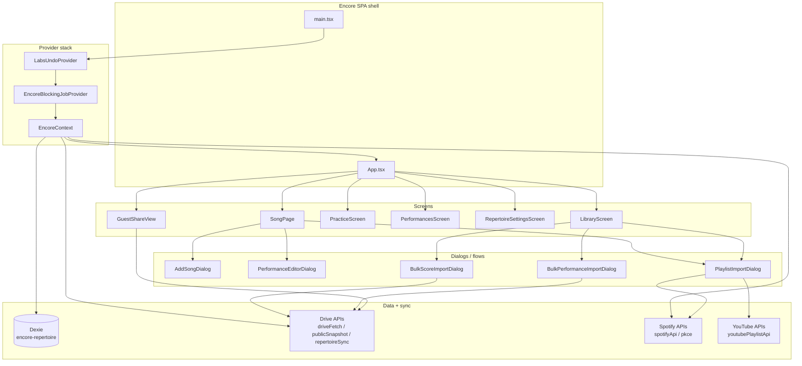
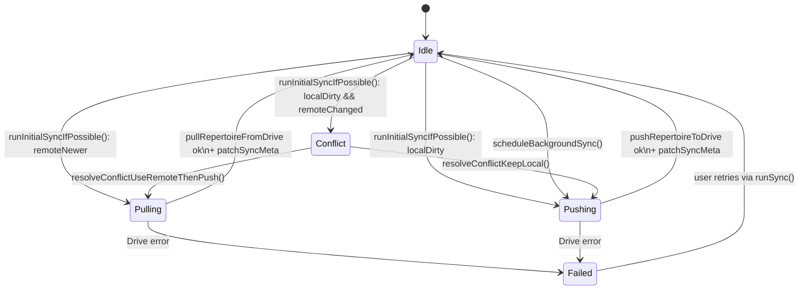

# Encore architecture

Detailed architectural notes for Project Encore. Pair with the high-level overview in [`README.md`](README.md) (start there) and the policy docs at the repo root (`AGENTS.md`, `DEVELOPMENT.md`, `STYLE_GUIDE.md`).

## Module map

## Sync state machine

`syncMeta` (Dexie row id `'default'`) records `lastRemoteEtag`, `lastRemoteModified`, `lastSyncedLocalMaxUpdatedAt`. The local clock is `maxRepertoireClock(songs, performances, extras.updatedAt)` — see [`drive/repertoireWire.ts`](drive/repertoireWire.ts).

## Module summaries

### `context/`

- **`EncoreContext.tsx`** — central provider. Owns Dexie state (songs, performances, extras), Google + Spotify session state, sync state (`syncState`, `conflict`), and action methods (`saveSong`, `deleteSong`, `savePerformance`, `runSync`, `scheduleBackgroundSync`, `publishPublicSnapshot`, `reorganizeDriveUploads`, plus undo wiring). Decomposition into focused sub-contexts (`EncoreAuthContext`, `EncoreLibraryContext`, `EncoreSyncContext`) is planned for PR 5.
- **`EncoreBlockingJobContext.tsx`** — long-running-job snackbar with progress + `beforeunload` warning. `withBlockingJob(label, fn)` is the canonical wrapper.

### `db/`

- **`encoreDb.ts`** — Dexie wrapper. Schema v3 with tables `songs`, `performances`, `syncMeta`, `repertoireExtras`. `getSyncMeta` lazily creates the singleton row; `patchSyncMeta` does an idempotent merge.

### `drive/`

- **`driveFetch.ts`** — typed wrappers over the Drive v3 REST API with retry/backoff for transient statuses, error surface (`DriveHttpError`).
- **`bootstrapFolders.ts`** — ensures the `Encore_App/` folder layout (Performances, SheetMusic, recordings) exists; returns ids.
- **`repertoireWire.ts`** — JSON schema for `repertoire_data.json` and merge utilities (`mergeRecordsByUpdatedAt`, `maxRepertoireClock`, `repertoireExtrasFromWire`).
- **`repertoireSync.ts`** — pull / push / conflict resolution. `runInitialSyncIfPossible` is the entry point. `pullRepertoireFromDrive` and `pushRepertoireToDrive` write through Dexie + update `syncMeta`. Two conflict resolvers: `resolveConflictUseRemoteThenPush`, `resolveConflictKeepLocal`.
- **`publicSnapshot.ts`** — builds and publishes the read-only `public_snapshot.json` (only-performed-songs filter, anyone-reader probe per Drive video, public-readability verification).
- **`performanceShortcut.ts`** — keeps performance video shortcuts (`Encore_App/Performances/...`) renamed to canonical `YYYY-MM-DD - Title - Artist` (venue not encoded in the filename).
- **`songAttachmentOrganize.ts`** — moves/renames song chart + recording attachments to the canonical Drive folders.
- **`driveReorganize.ts`** — top-level "tidy" that runs `bootstrapFolders` then both reorganizers in parallel.

### `import/`

- **`matchPlaylists.ts`** — Spotify ↔ YouTube row pairing. Houses the `PlaylistImportRow` shape, `splitPairedImportRow` / `mergeSplitPairRows`, dice/Jaccard similarity helpers, `encoreSongFromImportRow`.
- **`findExistingSongForImport.ts`** — fuzzy match between an incoming import row and the existing library; `mergeSongWithImport` honors `placement: 'reference' | 'backing'` so cross-section moves are explicit. Cross-section preview helpers (`crossSectionMovesForPlaylistRow`, `totalCrossSectionLinksForPlaylistImport`) drive the import-confirmation copy.
- **`importTitleNormalize.ts`** + **`libraryTitleMatchHeads.ts`** — heuristics for "Let It Go - From Frozen", "[Live]", soundtrack-style titles.

### `repertoire/`

- **`songMediaLinks.ts`** — read/write helpers for `referenceLinks` / `backingLinks`. Anything that mutates a song's media should go through here (and not poke `referenceLinks`/`backingLinks` directly).

### `spotify/` + `youtube/`

- Thin API wrappers; PKCE OAuth helpers; token storage (`localStorage` + `sessionStorage`); URL parsing (`parseSpotifyTrackUrl`, `parseYoutubeVideoUrl`, `youtubePlaylistApi`).

### `ui/`

Reusable components specific to Encore (see also `src/shared/components/` for cross-app primitives):

- **`EncoreMediaLinkRow.tsx`** — single row primitive (icon + caption + primary star + open + remove). Used by SongPage.
- **`encoreMediaLinkFormat.ts`** — caption + URL helpers for media links.
- **`EncoreStreamingHoverCard.tsx`** — hover popover with resolved title/artist (Spotify Web API + YouTube oEmbed).
- **`EncoreSpotifyTrackListRow.tsx`** — album art + title + artists row. Used by `renderSpotifyTrackAutocompleteOption` and `PlaylistImportDialog`'s Spotify picker.
- **`EncorePageHeader.tsx`**, **`EncoreToolbarRow.tsx`** — page chrome.

### `components/song/` and `components/playlistImport/`

Sub-component folders that hold extracted sections of the two largest screens. Each file is a pure presentational component (no Dexie / Drive / Spotify side-effects) — the parent screen owns state, threads it through props, and handles persistence. Extracting these keeps the parent screen file under control and makes each section independently reviewable.

- **`components/song/SongJournalEditor.tsx`** — Markdown editor + live preview + explicit Save Notes boundary. Receives `journalLocal`/`committedJournal` and `onSave` from `SongPage` (which keeps the autosave + commit-time-undo machinery intact).
- **`components/song/SongPerformancesPanel.tsx`** — "Performances" tab body: counter chip, "Add performance" CTA, venue filter chips, performance card grid with thumbnail + open/edit actions.
- **`components/playlistImport/PlaylistImportSpotifyPicker.tsx`** — "Link Spotify song" dialog used inside `PlaylistImportDialog`. Renders the import-track section and live Spotify search results; the parent owns row state and applies the selection.

Future extractions that fit this pattern (tracked in the Encore quality sweep plan): `SongHeroCard`, `SongMediaLinksSection`, `SongChartsSection`, `SongMilestonesPanel`; `PlaylistImportUrlsStep`, `PlaylistImportReviewStep`, `PlaylistImportRow`. The shared `EncoreContext` is also a candidate for splitting into focused sub-contexts (`EncoreAuthContext`, `EncoreLibraryContext`, `EncoreSyncContext`) once the call sites are first migrated to a `useEncore()` façade.

### `theme/`

- **`encoreUiTokens.ts`** — Encore-specific design tokens (`encoreRadius`, `encoreShadowSurface`, `encoreShadowLift`, `encoreDialogTitleSx`, `encoreDialogContentSx`, `encoreDialogActionsSx`, etc.). Use these instead of hardcoded values to keep the surface consistent.

### `routes/`

- **`encoreAppHash.ts`** — hash router for `#/song/<id>`, `#/practice`, `#/share/<fileId>`, etc.

## Cross-cutting patterns

- **Long-running jobs** → wrap with `useEncoreBlockingJobs().withBlockingJob(label, fn)`. Snackbar + `beforeunload` are automatic.
- **Undo** → call `pushUndo({ label, undo, redo })` from `EncoreContext` action methods. Replay-protected with `isReplayingRef`.
- **Dexie writes** → use the `EncoreContext` actions, not direct table calls, so undo + autosave + Drive push wiring stay consistent.
- **Drive uploads** → always use the helpers in `driveFetch` so retry/backoff + error formatting are uniform.

## Where things are tested

| Concern                             | Tests                                                                                                                                                                                                                                  |
| ----------------------------------- | -------------------------------------------------------------------------------------------------------------------------------------------------------------------------------------------------------------------------------------- |
| Sync orchestration                  | [`drive/repertoireSync.test.ts`](drive/repertoireSync.test.ts)                                                                                                                                                                         |
| Snapshot publish + permission probe | [`drive/publicSnapshot.test.ts`](drive/publicSnapshot.test.ts), [`drive/publicSnapshot.buildAndPublish.test.ts`](drive/publicSnapshot.buildAndPublish.test.ts)                                                                         |
| Snapshot ordering                   | [`drive/publicSnapshotSort.test.ts`](drive/publicSnapshotSort.test.ts)                                                                                                                                                                 |
| Drive file naming + reorganize      | [`drive/performanceShortcut.test.ts`](drive/performanceShortcut.test.ts), [`drive/driveReorganize.test.ts`](drive/driveReorganize.test.ts), [`drive/songAttachmentOrganize.test.ts`](drive/songAttachmentOrganize.test.ts)             |
| Dexie schema + sync meta            | [`db/encoreDb.test.ts`](db/encoreDb.test.ts)                                                                                                                                                                                           |
| Blocking-job snackbar contract      | [`context/EncoreBlockingJobContext.test.tsx`](context/EncoreBlockingJobContext.test.tsx)                                                                                                                                               |
| Import matching                     | [`import/findExistingSongForImport.test.ts`](import/findExistingSongForImport.test.ts), [`import/matchPlaylists.test.ts`](import/matchPlaylists.test.ts), [`import/importTitleNormalize.test.ts`](import/importTitleNormalize.test.ts) |
| Media link helpers                  | [`repertoire/songMediaLinks.test.ts`](repertoire/songMediaLinks.test.ts)                                                                                                                                                               |
