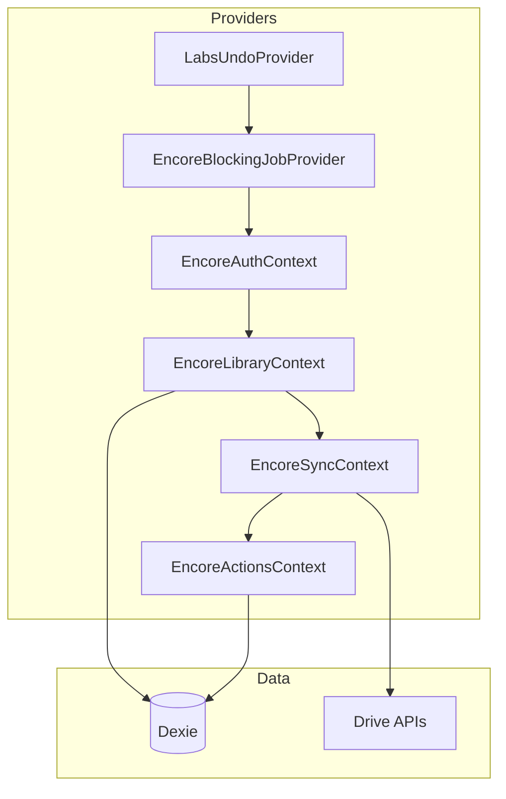
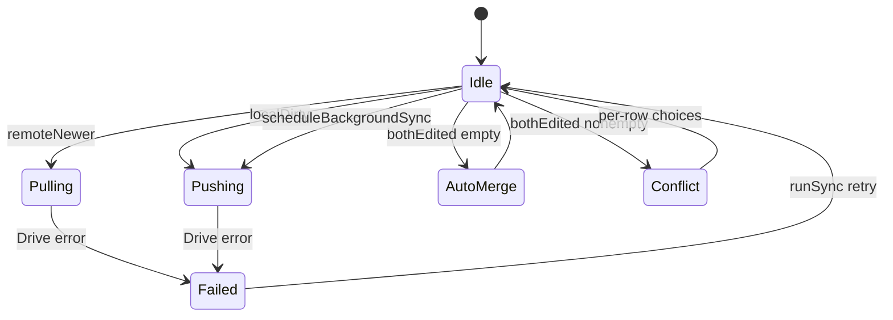

# Encore architecture

Model, Dexie, and Drive sync contracts. Product entry + ops: [`README.md`](README.md). Journeys: [`CUJs.md`](CUJs.md). Repo sync policy: [`docs/LOCAL_FIRST_SYNC.md`](../../docs/LOCAL_FIRST_SYNC.md).

## Module map



Hash routes: [`routes/encoreAppHash.ts`](routes/encoreAppHash.ts) (`#/library`, `#/song/<id>`, `#/practice`, `#/share/<fileId>`, `#/originals`, …).

## Provider contracts

| Context           | Owns                                                                                                  |
| ----------------- | ----------------------------------------------------------------------------------------------------- |
| **Auth**          | Google token / allowlist / Spotify connect — `useEncoreAuth()`                                        |
| **Library**       | Dexie live queries; `songsHydrated`, `libraryReady`, `useEncoreSong(id)` → `loading \| missing \| ok` |
| **Sync**          | `syncState`, conflict analysis, `scheduleBackgroundSync`, `resolveConflictWithChoices`                |
| **Actions**       | All Dexie mutations + undo + `markDirtyRow` + trigger background sync                                 |
| **Blocking jobs** | Thin wrap of shared `LabsBlockingJobContext` — `withBlockingJob`                                      |

`EncoreContext` flattens the four for back-compat. Prefer slice hooks so Dexie writes do not re-render unrelated chrome.

## Sync state machine



`syncMeta` (id `'default'`): `lastRemoteEtag`, `lastRemoteModified`, `lastSyncedLocalMaxUpdatedAt`, sharded bookkeeping. Local clock: `maxRepertoireClock` in [`drive/repertoireWire.ts`](drive/repertoireWire.ts).

### Conflict rules

`analyzeRepertoireConflict` → `localOnly` / `remoteOnly` / `bothEdited` ([`repertoireSync.ts`](drive/repertoireSync.ts)):

- **`bothEdited.length === 0`** — silent merge by `updatedAt` + push; snackbar via `lastSilentMerge`
- **else** — `SyncConflictReviewDialog` (per-row Keep device / Use Drive). Content-aware merge: ADR [0019](../../docs/adr/0019-encore-non-destructive-sync-merge.md), [`encoreRepertoireMerge.ts`](drive/encoreRepertoireMerge.ts)

### `runSync` vs `scheduleBackgroundSync`

| API                        | When                                                           | Job                                 |
| -------------------------- | -------------------------------------------------------------- | ----------------------------------- |
| `runSync()`                | Sign-in / token restore (after `libraryReady` + paint) / retry | Silent blocking job                 |
| `scheduleBackgroundSync()` | After local writes                                             | 500 ms debounce, serialized, silent |

Auto-sync waits for **`libraryReady`**, then two rAF ticks, before Drive I/O.

## Dexie (`db/encoreDb.ts`)

Schema v4+: `songs`, `performances`, `syncMeta`, `repertoireExtras`, **`dirtySync`** (`<kind>:<rowId>`). Mutations → `markDirtyRow`; sharded pusher drains via `takeDirtyRows` / `clearDirtyRows`.

## Drive modules

| Module                     | Role                                                      |
| -------------------------- | --------------------------------------------------------- |
| `repertoireWire.ts`        | Monolithic JSON schema + merge helpers                    |
| `repertoireSync.ts`        | Pull / push / conflict entry (`runInitialSyncIfPossible`) |
| `repertoireSharded.ts`     | Opt-in shards behind `VITE_ENCORE_SHARDED_SYNC`           |
| `encoreRepertoireMerge.ts` | Content-aware row merge (filled beats empty)              |
| `publicSnapshot.ts`        | `public_snapshot.json` publish + guest readability        |
| `bootstrapFolders.ts`      | `Encore_App/` layout                                      |
| `driveReorganize.ts`       | Dedup + tidy uploads (Account menu)                       |

### Sharded layout (opt-in)

```
Encore_App/
  repertoire_data.json          # legacy; still written during soak
  repertoire/
    manifest.json
    song/<id>.json
    performance/<id>.json
    extras/default.json
```

Writes: Actions `markDirtyRow` → `pushDirtyShards` + manifest → legacy monolithic push as safety net. Pulls: `pullChangedShards` by manifest `updatedAt`. Migration idempotent via `syncMeta.shardedMigratedAt`. Conflict analysis still uses monolithic file during soak.

**QA before shipping sync changes:** smoke flag off and on (`VITE_ENCORE_SHARDED_SYNC`). Cold load, edit song, add performance, optional two-tab conflict. Note modes exercised in the PR.

## Media model

Songs: `referenceLinks` / `backingLinks` as `EncoreMediaLink[]` — mutate via [`repertoire/songMediaLinks.ts`](repertoire/songMediaLinks.ts). Legacy `spotifyTrackId` / `youtubeVideoId` mirrored by helpers. Performances: `videos[]` + `primaryVideoId` (`performanceVideoModel`). Practice Listen↔Play DnD: `practiceResourceOrder.ts` + rule `encore-practice-resource-dnd.mdc`.

## Client performance (list tabs)

Keep-alive tabs in `EncoreMainShell` (`display: none` when inactive). Gate heavy work with `listActive` / `heavyListTabActive`. Frozen tab bodies: `useEncoreTabFrozenSnapshot`. Prefer slice hooks over `useEncore()`. Media: control plane vs transport contexts so `timeupdate` does not re-render grids. Rule: `encore-list-tab-performance.mdc`. Budgets: [`CUJs.md`](CUJs.md) CUJ-001.

MRT: stable row/cell `sx`, debounced search, accurate `columns` memo deps; virtualization defaults in `encoreMrtTableDefaults.ts`. Offscreen Drive thumbs: `useEncoreInViewport`.

## Cross-cutting

- Long jobs → `withBlockingJob`; `{ silent: true }` for background sync
- Undo → `pushUndo` from Actions (not Drive sync / OAuth)
- Dexie writes → Actions only (keeps undo + dirty + push wired)
- Drive HTTP → `driveFetch` helpers (retry/backoff)

## Tests

| Concern     | Tests                                               |
| ----------- | --------------------------------------------------- |
| Sync        | `drive/repertoireSync.test.ts`                      |
| Sharded     | `drive/repertoireSharded.test.ts`                   |
| Merge       | `drive/encoreRepertoireMerge.test.ts` (and related) |
| Snapshot    | `drive/publicSnapshot*.test.ts`                     |
| Dexie       | `db/encoreDb.test.ts`                               |
| Import      | `import/*.test.ts`                                  |
| Media links | `repertoire/songMediaLinks.test.ts`                 |
