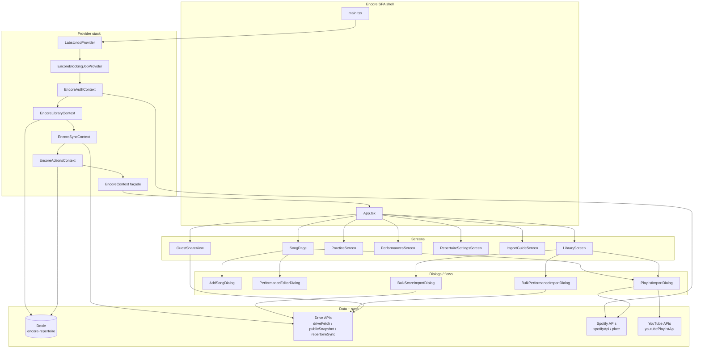
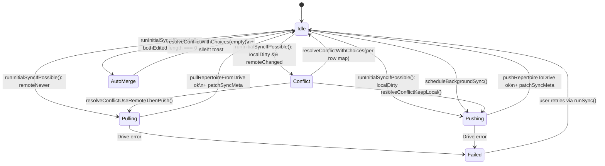

# Encore architecture

Detailed architectural notes for Project Encore. Pair with the high-level overview in [`README.md`](README.md) (start there) and the policy docs at the repo root (`AGENTS.md`, `DEVELOPMENT.md`, `STYLE_GUIDE.md`).

## Module map



## Sync state machine



`syncMeta` (Dexie row id `'default'`) records `lastRemoteEtag`, `lastRemoteModified`, `lastSyncedLocalMaxUpdatedAt`, plus the sharded-sync bookkeeping (`shardedRepertoireFolderId`, `shardedManifestFileId`, `shardedManifestRevision`, `shardedMigratedAt`). The local clock is `maxRepertoireClock(songs, performances, extras.updatedAt)` — see [`drive/repertoireWire.ts`](drive/repertoireWire.ts).

### Conflict UX (Phase 4)

Drive conflicts now go through a row-level analysis instead of an all-or-nothing dialog. When `runInitialSyncIfPossible` detects both sides changed since the last sync, it pulls the remote payload, classifies every song / performance row into `localOnly`, `remoteOnly`, or `bothEdited` (see `analyzeRepertoireConflict` in [`drive/repertoireSync.ts`](drive/repertoireSync.ts)), and:

- **`bothEdited.length === 0`**: silently calls `resolveConflictWithChoices(empty Map)` — non-conflicting changes auto-merge by `updatedAt` and the result is pushed back. The shell shows a brief "Merged X local + Y Drive changes" snackbar via `EncoreSyncContext.lastSilentMerge`.
- **otherwise**: surfaces `<SyncConflictReviewDialog>` with **only** the overlapping rows, per-row "Keep this device / Use Drive" choices, "Apply to all" toolbar, and an info-tooltip with the long-form explanation. The dialog calls `resolveConflictWithChoices(Map<id, 'local'|'remote'>)` to commit the merge in one push.

## Module summaries

### `context/`

The Encore data + sync layer is **split into four focused providers** that nest in a fixed order. `EncoreContext.tsx` is now a thin façade that composes them and exposes `useEncore()` for back-compat with screens that still expect the aggregate value. New code should reach for the specialized hooks (`useEncoreLibrary`, `useEncoreSync`, etc.) so consumers only re-render on the slice they care about.

- **`EncoreAuthContext.tsx`** — Google sign-in / sign-out, allowlist gating, Spotify connect state. Exposes `googleAccessToken`, `displayName`, `signInWithGoogle`, `signOut`, `connectSpotify` via `useEncoreAuth()`.
- **`EncoreLibraryContext.tsx`** — reactive Dexie selectors via [`dexie-react-hooks`](<https://dexie.org/docs/dexie-react-hooks/useLiveQuery()>): `songs`, `performances`, `repertoireExtras`. Exposes **`songsHydrated`** once the songs live query has emitted (so empty lists are not mistaken for “still loading”), **`libraryReady`** when all three tables have emitted (used by Drive auto-sync + any screen that needs full index consistency), and **`useEncoreSong(id)`** which returns `{ status: 'loading' | 'missing' | 'ok' }` so `SongPage` can hydrate from the row alone without waiting on `libraryReady`.
- **`EncoreSyncContext.tsx`** — Drive sync state machine (`syncState`, `syncMessage`, `conflict`, `conflictAnalysis`, `lastSilentMerge`), `scheduleBackgroundSync`, the per-row `resolveConflictWithChoices`, plus the legacy "all local" / "all remote" resolvers for back-compat. Wraps `runInitialSyncIfPossible` and the silent auto-merge path described above.
- **`EncoreActionsContext.tsx`** — every Dexie mutation (`saveSong`, `deleteSong`, `savePerformance`, `deletePerformance`, `bulkSaveSongs`, `bulkDeleteSongs`, `bulkSavePerformances`, `bulkDeletePerformances`, `saveRepertoireExtras`, `setOwnerDisplayName`). Each action is a granular Dexie write that pushes a single undo entry, marks the row dirty in the `dirtySync` table, and triggers `scheduleBackgroundSync()` once. Bulk variants wrap their writes in a single Dexie transaction so 50 songs get 50 dirty marks but **one** undo entry and **one** debounced push.
- **`EncoreContext.tsx`** — composer + back-compat façade. Renders the providers in `Auth → Library → Sync → Actions` order and exposes `useEncore()` that flattens the four context values into the legacy shape.
- **`EncoreBlockingJobContext.tsx`** — long-running-job snackbar with progress; `beforeunload` is registered only while **at least one non-silent** job is running. `withBlockingJob(label, fn)` is the canonical wrapper.

### `db/`

- **`encoreDb.ts`** — Dexie wrapper. Schema v4 with tables `songs`, `performances`, `syncMeta`, `repertoireExtras`, **`dirtySync`** (compound id `<kind>:<rowId>`, indexed by `kind` + `markedAt`). `getSyncMeta` lazily creates the singleton row; `patchSyncMeta` does an idempotent merge. The `dirtySync` table feeds the sharded sync (Phase 5): mutations call `markDirtyRow(kind, rowId, op)` and the background pusher drains via `takeDirtyRows` + `clearDirtyRows`.

### `drive/`

- **`driveFetch.ts`** — typed wrappers over the Drive v3 REST API with retry/backoff for transient statuses, error surface (`DriveHttpError`). Includes `driveTrashFile` used by the sharded sync to retire per-row JSONs.
- **`bootstrapFolders.ts`** — ensures the `Encore_App/` folder layout (Performances, SheetMusic, recordings) exists; returns ids.
- **`repertoireWire.ts`** — JSON schema for `repertoire_data.json` and merge utilities (`mergeRecordsByUpdatedAt`, `maxRepertoireClock`, `repertoireExtrasFromWire`).
- **`repertoireSync.ts`** — monolithic-file pull / push / conflict resolution. `runInitialSyncIfPossible` is the entry point and now also returns a row-level `ConflictAnalysis` so the new dialog can ask only about overlapping rows. Resolvers: `resolveConflictWithChoices(Map<id, 'local'|'remote'>)` (canonical), plus `resolveConflictUseRemoteThenPush` / `resolveConflictKeepLocal` (legacy convenience adapters used for the "Use Drive everywhere" / "Keep this device everywhere" buttons).
- **`repertoireSharded.ts`** — Phase 5 sharded layout. Behind the `VITE_ENCORE_SHARDED_SYNC` env flag (`isShardedSyncEnabled()`). Lays out `Encore_App/repertoire/{manifest.json, song/<id>.json, performance/<id>.json, extras/default.json}`, exposes `pushDirtyShards(token)` (drains the `dirtySync` table → uploads only changed shards → patches the manifest), `pullChangedShards(token)` (per-shard incremental pull driven by manifest `updatedAt`s), and `migrateMonolithicToShardedIfNeeded(token)` for the one-time fan-out from `repertoire_data.json`. The legacy monolithic push still runs alongside for a soak window.
- **`publicSnapshot.ts`** — builds and publishes the read-only `public_snapshot.json` (only-performed-songs filter, anyone-reader probe per Drive video, public-readability verification).
- **`performanceShortcut.ts`** — keeps performance video shortcuts (`Encore_App/Performances/...`) renamed to canonical `YYYY-MM-DD - Title - Artist` (venue not encoded in the filename).
- **`songAttachmentOrganize.ts`** — moves/renames song chart + recording attachments to the canonical Drive folders.
- **`driveReorganize.ts`** — top-level "tidy" that runs `bootstrapFolders` then both reorganizers in parallel.

### `import/`

- **`matchPlaylists.ts`** — Spotify ↔ YouTube row pairing. Houses the `PlaylistImportRow` shape, `splitPairedImportRow` / `mergeSplitPairRows`, dice/Jaccard similarity helpers, `encoreSongFromImportRow`.
- **`findExistingSongForImport.ts`** — fuzzy match between an incoming import row and the existing library; `mergeSongWithImport` honors `placement: 'reference' | 'backing'` so cross-section moves are explicit. Cross-section preview helpers (`crossSectionMovesForPlaylistRow`, `totalCrossSectionLinksForPlaylistImport`) drive the import-confirmation copy.
- **`importTitleNormalize.ts`** + **`libraryTitleMatchHeads.ts`** — heuristics for "Let It Go - From Frozen", "[Live]", soundtrack-style titles.

### `repertoire/`

- **`songMediaLinks.ts`** — read/write helpers for `referenceLinks` / `backingLinks`. Anything that mutates a song's media should go through here (and not poke `referenceLinks`/`backingLinks` directly).

### `spotify/` + `youtube/`

- Thin API wrappers; PKCE OAuth helpers; token storage (`localStorage` + `sessionStorage`); URL parsing (`parseSpotifyTrackUrl`, `parseYoutubeVideoUrl`, `youtubePlaylistApi`).

### `ui/`

Reusable components specific to Encore (see also `src/shared/components/` for cross-app primitives):

- **`EncoreMediaLinkRow.tsx`** — single row primitive (icon + caption + primary star + open + remove). Used by SongPage.
- **`encoreMediaLinkFormat.ts`** — caption + URL helpers for media links.
- **`EncoreStreamingHoverCard.tsx`** — hover popover with resolved title/artist (Spotify Web API + YouTube oEmbed).
- **`EncoreSpotifyTrackListRow.tsx`** — album art + title + artists row. Used by `renderSpotifyTrackAutocompleteOption` and `PlaylistImportDialog`'s Spotify picker.
- **`EncorePageHeader.tsx`**, **`EncoreToolbarRow.tsx`** — page chrome.

### `components/song/` and `components/playlistImport/`

Sub-component folders that hold extracted sections of the two largest screens. Each file is a pure presentational component (no Dexie / Drive / Spotify side-effects) — the parent screen owns state, threads it through props, and handles persistence. Extracting these keeps the parent screen file under control and makes each section independently reviewable.

- **`components/song/SongJournalEditor.tsx`** — Markdown editor + live preview + explicit Save Notes boundary. Receives `journalLocal`/`committedJournal` and `onSave` from `SongPage` (which keeps the autosave + commit-time-undo machinery intact).
- **`components/song/SongPerformancesPanel.tsx`** — "Performances" tab body: counter chip, "Add performance" CTA, venue filter chips, performance card grid with thumbnail + open/edit actions.
- **`components/playlistImport/PlaylistImportSpotifyPicker.tsx`** — "Link Spotify song" dialog used inside `PlaylistImportDialog`. Renders the import-track section and live Spotify search results; the parent owns row state and applies the selection.
- **`components/ImportGuideScreen.tsx`** — in-app import documentation (`#/help`); kept aligned with folder-walk rules in `import/encoreFolderMetadata.ts` and bulk import dialogs.

Further splits that would still shrink the largest screens (optional): hero/media sections on `SongPage`, or step components inside `PlaylistImportDialog`.

### `theme/`

- **`encoreUiTokens.ts`** — Encore-specific design tokens (`encoreRadius`, `encoreShadowSurface`, `encoreShadowLift`, `encoreDialogTitleSx`, `encoreDialogContentSx`, `encoreDialogActionsSx`, etc.). Use these instead of hardcoded values to keep the surface consistent.

### `routes/`

- **`encoreAppHash.ts`** — hash router for `#/song/<id>`, `#/practice`, `#/share/<fileId>`, etc.

## Drive sync UX and client performance

- **Initial Drive sync** (`runSync` in `EncoreSyncContext.tsx`) uses a **silent** `withBlockingJob('Syncing with Google Drive…', …, { silent: true })` so the shell stays visually unobstructed and **does not** register `beforeunload` (only **non-silent** jobs do). Status remains visible via `syncState` / **Encore account menu** (“Syncing…”).
- **When auto-sync runs**: after Google sign-in / token restore, sync waits until **`libraryReady`** is true, then **two `requestAnimationFrame` ticks** (`waitForNextPaint`) so the first Dexie-backed library paint can commit before Drive I/O.
- **`runInitialSyncIfPossible(accessToken, { onProgress })`** reports coarse 0–1 progress into the blocking job (useful if a visible progress UI is added later). **`pullRepertoireFromDrive`** yields one frame before the Dexie transaction and updates `lastSyncedLocalMaxUpdatedAt` from **merged arrays in memory** (no second full-table read). **`pushRepertoireToDrive`** yields before `JSON.stringify`.
- **`scheduleBackgroundSync`** is **debounced (500ms)** and **serialized** with a promise chain so rapid saves coalesce and concurrent silent pushes do not stack. It uses a **silent** blocking job, so it does not arm `beforeunload`.
- **`bootstrapFolders.ts` `createEncoreDriveLayout`** lists/creates the Performances / Sheet music / Recordings subfolders under `Encore_App/` with **`Promise.all`** where ordering allows, and lists repertoire + snapshot JSON in parallel.

### Sharded Drive sync (Phase 5)

The monolithic `repertoire_data.json` scales **O(library)** for every read and write. The sharded layout addresses that for incremental writes by giving each row its own JSON file under `Encore_App/repertoire/`:

```
Encore_App/
  repertoire_data.json           # legacy monolithic file (still written, for now)
  repertoire/
    manifest.json                # row id → { fileId, updatedAt } index
    song/<songId>.json           # one shard per song
    performance/<perfId>.json    # one shard per performance
    extras/default.json          # venue catalog + milestone template
```

How writes flow:

1. Every action in `EncoreActionsContext` calls `markDirtyRow(kind, id, op)` after its Dexie write. Bulk operations use `markDirtyRows([...])` so the table coalesces.
2. `scheduleBackgroundSync` (debounced + serialized in `EncoreSyncContext`) checks `isShardedSyncEnabled()` and, when on, calls `migrateMonolithicToShardedIfNeeded(token)` (no-op after first run) followed by `pushDirtyShards(token)` to upload only the changed rows + republish `manifest.json`. The legacy `pushRepertoireToDrive(...)` still runs after the shard push as a safety net while the sharded path soaks.
3. Pulls go through `pullChangedShards(token)`: read `manifest.json`, fetch only the shard JSONs whose `updatedAt` exceeds the local row, and delete Dexie rows the manifest no longer lists.

Migration is one-shot and idempotent (skipped when `syncMeta.shardedMigratedAt` is set or the manifest already contains rows). Conflict detection still happens against the monolithic file during the soak; once the sharded path graduates, conflict analysis will run against the manifest's per-row `updatedAt`s for finer granularity.

Tests: [`drive/repertoireSharded.test.ts`](drive/repertoireSharded.test.ts) covers push (create vs. PATCH), delete, idempotent migration, and incremental pull.

#### Sync QA checklist (manual, before shipping Drive sync changes)

Smoke **both** modes when touching sync: set `VITE_ENCORE_SHARDED_SYNC` to off vs `1`/`true` in `src/.env.development`, restart `npm run dev`, and reload Encore.

| Check                   | Monolithic default (flag off)                                               | Sharded (flag on)                                                                              |
| ----------------------- | --------------------------------------------------------------------------- | ---------------------------------------------------------------------------------------------- |
| Cold load after sign-in | Library + performances load; sync completes; account menu leaves “Syncing…” | Same; one-time sharded migration may run (`syncMeta.shardedMigratedAt`)                        |
| Edit a song field       | Saves locally; debounced background push; second tab / refresh sees update  | `markDirtyRow` → shard upload + manifest bump; legacy monolithic push still runs as safety net |
| Add performance         | Row appears; Drive reflects after sync                                      | Performance shard + manifest                                                                   |
| Optional conflict drill | Two tabs edit same row → conflict review resolves                           | Same while monolithic soak applies                                                             |

Note in the PR which mode(s) you exercised if you only had time for one.

## Client performance guardrails (list screens)

- Prefer **stable** `muiTableBodyRowProps` / cell `sx` (plain objects or `useMemo`), not a fresh `() => ({ sx: (theme) => … })` each render. **Zebra striping** on large MRT tables can add scroll-linked paint cost; prefer hover-only row emphasis unless product design requires stripes.
- **Debounce** free-text search that feeds table `data` (see Library / Performances). Keep `columns` **`useMemo`** dependency arrays **accurate** so column defs are not rebuilt on unrelated state (Library and Performances scope search **highlight** via a small React context so `debouncedSearch` does not invalidate MRT column defs).
- MRT `enableRowVirtualization: true` is the default for the repertoire and performances tables (`encoreMrtTableDefaults.ts`). Both files freeze the option objects at module scope so the same reference flows into MRT every render.
- Heavy Markdown renders (e.g. song journal preview) use `React.memo` + `useDeferredValue` so typing in a long doc does not block interaction; see `MarkdownPreview.tsx`.
- Drive thumbnails for performance videos are gated on `useEncoreInViewport(ref)` so offscreen rows never fire a `driveResolveThumbnailLink` request.

## Cross-cutting patterns

- **Long-running jobs** → wrap with `useEncoreBlockingJobs().withBlockingJob(label, fn)`. Snackbar + `beforeunload` apply to **non-silent** jobs; use `{ silent: true }` for background work that should not prompt on tab close.
- **Undo** → call `pushUndo({ label, undo, redo })` from `EncoreActionsContext` action methods (or the composed `useEncore()` façade). Replay-protected with `isReplayingRef`.
- **Dexie writes** → use the `EncoreActionsContext` actions (or `useEncore()`), not direct table calls, so undo + autosave + Drive push wiring stay consistent.
- **Drive uploads** → always use the helpers in `driveFetch` so retry/backoff + error formatting are uniform.

## Where things are tested

| Concern                               | Tests                                                                                                                                                                                                                                  |
| ------------------------------------- | -------------------------------------------------------------------------------------------------------------------------------------------------------------------------------------------------------------------------------------- |
| Sync orchestration                    | [`drive/repertoireSync.test.ts`](drive/repertoireSync.test.ts)                                                                                                                                                                         |
| Sharded sync (push / pull / migrate)  | [`drive/repertoireSharded.test.ts`](drive/repertoireSharded.test.ts)                                                                                                                                                                   |
| Snapshot publish + permission probe   | [`drive/publicSnapshot.test.ts`](drive/publicSnapshot.test.ts), [`drive/publicSnapshot.buildAndPublish.test.ts`](drive/publicSnapshot.buildAndPublish.test.ts)                                                                         |
| Snapshot ordering                     | [`drive/publicSnapshotSort.test.ts`](drive/publicSnapshotSort.test.ts)                                                                                                                                                                 |
| Drive file naming + reorganize        | [`drive/performanceShortcut.test.ts`](drive/performanceShortcut.test.ts), [`drive/driveReorganize.test.ts`](drive/driveReorganize.test.ts), [`drive/songAttachmentOrganize.test.ts`](drive/songAttachmentOrganize.test.ts)             |
| Dexie schema + sync meta              | [`db/encoreDb.test.ts`](db/encoreDb.test.ts)                                                                                                                                                                                           |
| Blocking-job snackbar contract        | [`context/EncoreBlockingJobContext.test.tsx`](context/EncoreBlockingJobContext.test.tsx)                                                                                                                                               |
| Import matching                       | [`import/findExistingSongForImport.test.ts`](import/findExistingSongForImport.test.ts), [`import/matchPlaylists.test.ts`](import/matchPlaylists.test.ts), [`import/importTitleNormalize.test.ts`](import/importTitleNormalize.test.ts) |
| Drive folder metadata (`Key - Value`) | [`import/encoreFolderMetadata.test.ts`](import/encoreFolderMetadata.test.ts)                                                                                                                                                           |
| Media link helpers                    | [`repertoire/songMediaLinks.test.ts`](repertoire/songMediaLinks.test.ts)                                                                                                                                                               |
